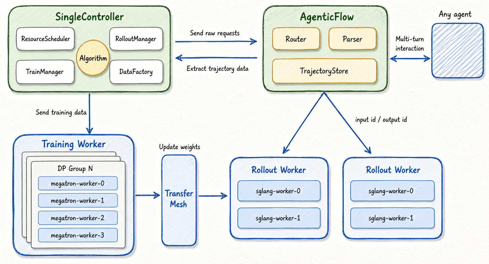
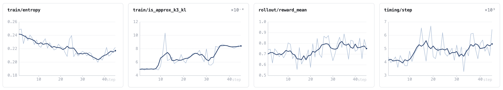
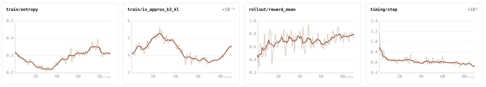
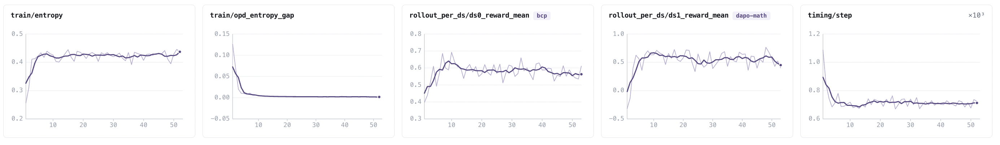
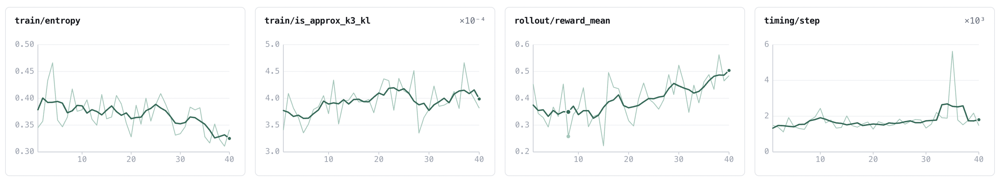

<div align="center">

<div align="right">
  <strong>中文</strong> | <a href="https://baidu-baige.github.io/LoongSage/">English</a>
</div>

# LoongSage: the coda of LLM training

**Agentic · Scalable · Lightweight**

面向超大模型与智能体的工业级极简强化学习框架

<p>
  <a href="./LICENSE"></a>
  
  
  
  
</p>

</div>

______________________________________________________________________

**LoongSage** 是一个大语言模型强化学习后训练框架，以 Ray 为调度底座，Megatron-Core 为训练后端、SGLang 为推理后端。它专注于：**用极简的架构训练超大规模模型**、**支持任意智能体零侵入接入**、**以及提供系统性的训推一致性保证**。

______________________________________________________________________

## 🌟 核心特性 (Features)

### 🤖 通用性 — 任意智能体、任意范式、任意数据组合

- **智能体零侵入接入** — 智能体只需通过标准 chat completion 接口调用框架提供的推理服务；多轮上下文拼接、工具输出识别、损失掩码、轨迹采集与沙箱全生命周期管理均由内置 AgentFlow 模块自动完成，框架底座与智能体业务逻辑完全解耦。
- **多范式在线蒸馏** — 原生支持 PG-Style、GKD-Style 及混合蒸馏模式，内置 TopK、全词表、JSD 等 KL 蒸馏策略，并支持多教师蒸馏。
- **多数据源混合训练** — 每个数据源可独立配置智能体、奖励函数、教师模型与采样超参数，且各数据源比例在每个 Rank、每个 Mini-Batch 上严格保持全局一致。

### ✅ 正确性 — 收敛可复现，偏差可观测

- **开箱即用的训练配方** — 数学、Agent代码修复、多老师在线蒸馏等典型场景均提供已调优的完整配置（DeepSeek-V4-Flash、Qwen3-30B-A3B）；配方经百度内部真实业务训练持续打磨，无需自行摸索超参即可稳定收敛。
- **系统级训推一致性保证** — 内置专家路由回放 (R3)、FP32 输出层、TITO、重要性采样修正、M2PO、OPSM 等一致性对齐技术，并提供分布偏差实时监控；在 MoE 架构与低精度场景下可将训推概率偏差稳定控制在万分位量级，显著降低训练崩溃风险。

### ⚡ 效率 — 超大规模下的吞吐极致优化

- **全异步训练** — 支持 Partial Rollout 与过采样，采样与训练完全解耦、并行推进、时间上相互重叠，可灵活配置数据陈旧度与滑动窗口策略，有效解决长尾请求拖慢全局训练的问题，实验中吞吐量提升 39%。
- **自适应权重同步机制** — 训练与推理引擎间的权重同步自动选择最优路径：同卡部署采用 CUDA IPC 零拷贝直传，跨卡分布式采用 NCCL 高效广播；张量按桶聚合进入共享缓冲区，大幅提升传输带宽利用率。
- **灵活的资源部署** — 基于 Ray Placement Group 实现 GPU 资源的精细化分配，同卡复用与分离式部署可一键切换，并在同卡模式下精准协调训练与推理的显存分配。

### 🧩 易用性与扩展性 — 轻量内核，随处可改

- **高可扩展的插件系统** — 提供多达 12 个核心扩展点（涵盖智能体、奖励模型、沙箱、优势估计、策略损失、KL 散度、路由中间件、数据过滤及异步调度策略等），只需将新增实现放入对应目录并在配置中引用，即可热插拔生效，无需改动框架主干代码。
- **低耦合的后端集成** — 框架内核极致轻量，仅依赖 Megatron-Core、Megatron-Bridge 及 SGLang，各后端模块可独立、平滑地升级，并透明继承上游训练与推理框架的全部特性，无需繁琐的框架层适配；支持的模型库亦随 Megatron-Bridge 生态更新自动扩展。

______________________________________________________________________

## 📰 最新动态 (News)

- **[2026-08]** LoongSage 正式开源！

______________________________________________________________________

## 🏗️ 系统架构 (Architecture)



面向超大模型场景，LoongSage 采用**单控制器（Single-Controller）编排、多角色 Ray Actor 执行**的结构，大幅降低了系统维护的复杂度：

| 层 | 模块 | 职责 |
| :--- | :--- | :--- |
| 编排 | [`controller/`](coda/controller/) | 系统的唯一入口，负责驱动训练、采样、教师推理与权重同步，并在同卡模式下精准协调显存分配。 |
| 智能体 | [`agentflow/`](coda/agentflow/) | 负责请求路由、轨迹存储、分词处理、智能体与沙箱生命周期，产出可供训练侧精确复放的标准化轨迹。 |
| 后端 | [`backends/`](coda/backends/) | 训练、推理、教师三类 Worker 的通用抽象接口，及其基于 Megatron 和 SGLang 的底层实现。 |
| 算法 | [`algorithms/`](coda/algorithms/) | 涵盖优势函数估计、策略损失计算、散度约束策略与离策略 (Off-policy) 保护机制。 |
| 数据 | [`data_factory/`](coda/data_factory/) | 管理数据集加载、可续采数据源、采样过滤机制以及基于负载均衡的数据切分分发。 |
| 传输 | [`transfer_mesh/`](coda/transfer_mesh/) | 训练与推理引擎之间的高性能统一数据传输通道。 |
| 调度 | [`resource_scheduler/`](coda/resource_scheduler/) | 基于 Ray Placement Group 实现 GPU 资源的精细化分配，完美支持同卡复用与分离式部署。 |

______________________________________________________________________

## 🛠️ 安装指南 (Installation)

推荐使用容器镜像运行，镜像内已严格对齐 CUDA、PyTorch、Megatron-Core、Megatron-Bridge、SGLang 与 Ray 的依赖版本，并已应用必要的 SGLang 补丁。

```bash
# 拉取镜像
docker pull loongsage/loongsage:latest

# 或基于源码本地构建
docker build -t loongsage/loongsage:latest docker/

docker run -it --gpus all --ipc=host --network=host \
  -v /path/to/workspace:/root loongsage/loongsage:latest bash
```

## ⚡ 快速开始 (Quick Start)

所有训练共用同一入口 [`examples/start.sh`](examples/start.sh)，通过 Hydra 配置名区分任务，配置名之后可追加任意 Hydra 覆盖项：

```bash
bash examples/start.sh <配置名> [key=value ...]
```

配置名对应 [`conf/`](conf/) 下的文件，可含子目录（如 `qwen3_30b_a3b/dapo_h20_1node`）。脚本在后台启动训练，日志写入 `log/trainer_<时间戳>.log`。

### 单机跑通第一个例子：Qwen3-4B + DAPO

下载模型与数据集：

```bash
hf download Qwen/Qwen3-4B --local-dir /root/Qwen3-4B
hf download Haitao999/DAPO-Math-17k-unique --repo-type=dataset \
  --local-dir /root/DAPO-Math-17k-unique
```

启动单机 8 卡预设 [`qwen3_4b/dapo_h800_1node`](conf/qwen3_4b/dapo_h800_1node.yaml)，在命令行上填好模型与数据路径即可：

```bash
bash examples/start.sh qwen3_4b/dapo_h800_1node \
  hf_model_path=/root/Qwen3-4B \
  data_source.dataset.prompt_data_path=/root/DAPO-Math-17k-unique
```

更多内容见文档：

- 从环境准备、数据下载到结果验证的完整第一次上手 → [快速开始](docs/zh/quick-start.md)
- 多机训练准备、其余示例任务（Qwen3-30B-A3B 的 DAPO / BCP / MOPD、DeepSeek-V4-Flash 的 SWE、OpenCode 黑盒智能体）、运行监控与断点续训 → [运行指南](docs/zh/run-guide.md)

______________________________________________________________________

## 📚 详细文档 (Documentation)

| 文档 | 内容 |
| :--- | :--- |
| [AgentFlow 框架](docs/zh/agentflow-framework.md) | 路由器、轨迹存储、分词服务、多轮与工具调用 |
| [自定义智能体](docs/zh/custom-agent.md) · [奖励](docs/zh/custom-reward.md) · [沙箱](docs/zh/custom-sandbox.md) | 主要扩展点教程 |
| [自定义RL算法](docs/zh/custom-algorithm.md) · [KL算法](docs/zh/custom-kl.md) · [滑动窗口策略](docs/zh/custom-sliding-window.md) | 算法侧扩展点教程 |
| [全异步训练](docs/zh/fully-async-mode.md) | 架构、滑动窗口策略、指标与调优 |
| [训练算法](docs/zh/training-algorithms.md) | 优势、损失、离策略保护与执行顺序 |
| [在线策略蒸馏](docs/zh/on-policy-distillation.md) | PG / GKD、全词表、多教师 |
| [训推一致性](docs/zh/train-inference-consistency.md) | 路由回放、FP32 输出层与监控 |
| [TransferMesh](docs/zh/transfer-mesh.md) | 权重传输设计与性能数据 |
| [资源调度](docs/zh/resource-scheduler.md) | Placement group、bundle 排序、共置/分离放置策略 |
| [模型加载与保存](docs/zh/model-checkpointing.md) | 目录结构、断点续训、HF 导出与优化器分片格式 |
| [配置参数速查](docs/zh/config-reference.md) | `conf/default.yaml` 全字段说明与跨字段约束 |

英文文档见 [`docs/en/`](docs/en/)。

## 🗺️ 路线图 (Roadmap)

以下为后续主要开发计划，欢迎通过 Issue 参与讨论与共建：

- [ ] Claude Code & Codex支持
- [ ] 低精度训练支持
- [ ] PPO能力支持
- [ ] MTP/DSpark
- [ ] PD 分离部署
- [ ] 全异步场景下的多数据源、多智能体支持
- [ ] SFT能力支持
- [ ] LORA能力支持
- [ ] 多教师权重分布式存储
- [ ] 全模态支持

______________________________________________________________________

## 🚀 训练效果 (Performance)

以下曲线均取自单次真实训练，图中指标名与框架内置 metric 一致。`train/is_approx_k3_kl` 是训推概率偏差的 K3 估计，`timing/step` 为每步端到端耗时。

#### DeepSeek-V4-Flash · SWE（[`dsv4_flash_bf16/swe_h20_8node`](conf/dsv4_flash_bf16/swe_h20_8node.yaml)）



#### DeepSeek-V4-Flash · DAPO（[`dsv4_flash_bf16/dapo_h20_6node`](conf/dsv4_flash_bf16/dapo_h20_6node.yaml)）



#### Qwen3-30B-A3B · MOPD 多教师全词表蒸馏（[`qwen3_30b_a3b/mopd_h20_1node`](conf/qwen3_30b_a3b/mopd_h20_1node.yaml)）



#### Qwen3-Coder-30B-A3B · OpenCode（[`qwen3_coder_30b_a3b/opencode_h20_4node`](conf/qwen3_coder_30b_a3b/opencode_h20_4node.yaml)）



______________________________________________________________________

## 👨‍💻 开发与贡献 (Contributing)

```bash
bash build.sh test                        # 全量单测与分支覆盖率
bash build.sh test tests/ut/algorithms    # 指定目录
```

我们非常欢迎来自社区的 Issue 与 Pull Request！新增能力建议通过上述扩展点接入，避免修改框架主干。完整的贡献流程、提交信息规范与提交前检查清单，请仔细阅读[CONTRIBUTING_zh.md](CONTRIBUTING_zh.md)（[English](CONTRIBUTING.md)）。

______________________________________________________________________

## 🙏 致谢 (Acknowledgments)

LoongSage 的诞生离不开开源社区的繁荣。我们要特别感谢以下优秀的开源项目：

LoongSage 的核心底座建立在以下项目之上，它们为框架提供了强大的训练、推理与调度能力：
- [Megatron-LM](https://github.com/NVIDIA/Megatron-LM) 与 [Megatron-Bridge](https://github.com/NVIDIA-NeMo/Megatron-Bridge) — 大规模分布式训练底层支持与 HF ↔ Megatron 权重桥接。
- [SGLang](https://github.com/sgl-project/sglang) — 高性能、高吞吐的推理引擎抽象。
- [Ray](https://github.com/ray-project/ray) — 灵活高效的分布式任务调度器。

LoongSage 在架构设计与代码实现层面，大量参考并学习了以下杰出的工作：
- [slime](https://github.com/THUDM/slime) — 我们的核心代码实现参考了 slime 的架构与逻辑，特别是在精简架构的设计上给了我们极大的启发与参考，特此向 THUDM 团队表达诚挚的感谢！
- [verl](https://github.com/verl-project/verl) — 提供了优秀的可扩展强化学习训练与推理框架设计范式。
- [Agent-Lightning](https://github.com/microsoft/agent-lightning) — 为我们解耦 Agent 框架与强化学习后训练平台提供了重要的灵感。

## 📜 引用 (Citation)

如果 LoongSage 对你的研究有帮助，请考虑引用本项目：

```bibtex
@software{loongsage,
  title  = {LoongSage: An Agent-Native Asynchronous Reinforcement Learning Framework for LLM Post-Training},
  author = {LoongSage Contributors},
  year   = {2026},
  url    = {https://github.com/baidu-baige/LoongSage/}
}
```

## 📄 许可证 (License)

本项目基于 [Apache License 2.0](./LICENSE) 开源。
