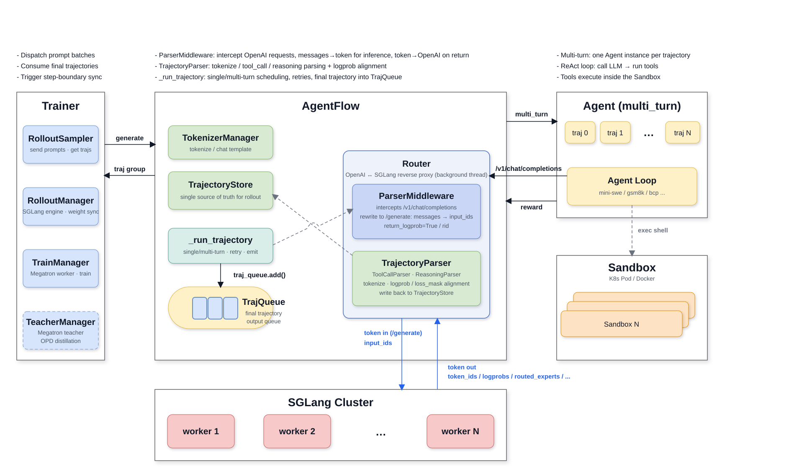

# AgentFlow Module Overview

AgentFlow is the core module responsible for **rollout (sampling) orchestration** in the LoongSage reinforcement learning framework. It turns "a batch of prompts dispatched by the training side" into "trajectories that can be directly used for training (with token, logprob, loss mask, and other alignment information)," and manages all the details along the way: inference request routing, multi-turn agent execution, code sandboxes, failure retries, and aborts.

In one sentence: **AgentFlow is the middle layer between the agent, the inference engine, and the trainer** — it receives the `Trajectory` dispatched by the training controller on top, drives the SGLang inference backend and the agent below, and ultimately produces sampling sequences that are strictly aligned with training.

The single most important design constraint is this: **the actual interaction with the LLM is token in / token out over SGLang's native `/generate` endpoint, not OpenAI `/v1/chat/completions`**. Agents still write plain OpenAI code; the Router rewrites in both directions — on the request path it converts `messages` into `input_ids` with the shared tokenizer and posts them to `/generate`, and on the response path it turns the returned `output_token_logprobs` back into an OpenAI response for the agent. As a result, "the token sequence fed to the model during sampling" and "the token sequence replayed during training" are literally the same data, with no text re-tokenization in between.

## 1. Overall Architecture

AgentFlow consists of an orchestrator (`AgentFlow`) and several collaborating components. The orchestrator holds 4 collaborating components internally, among which the Router runs in a background thread with a middleware chain attached:



Key points:

- **The Router is the core reason training alignment exists**: the agent requests the LLM through the standard OpenAI interface, and the Router intercepts and rewrites the request into SGLang's native `/generate` — sending `input_ids` into inference (token in) and taking back `token_ids + logprob` (token out). With the help of middleware, it collects per-token logprob, weight version, etc. and writes them into `TrajectoryStore`, ensuring the "sampling sequence" is strictly consistent with the "training-replayable sequence."
- **TrajectoryStore is the single source of truth for data during sampling**, shared by `AgentFlow` and the Router's `ParserMiddleware`.
- **One trajectory corresponds to one Agent instance** (multi-turn mode); single-turn mode does not create an agent and has AgentFlow call the Router directly.

## 2. Core Components

### 2.1 AgentFlow Orchestrator

The entry class is `AgentFlow` in [agent_flow.py](../../coda/agentflow/agent_flow.py). It completes three initialization steps in `__init__`:

1. `_init_per_datasource()` — initializes the agent class and reward function per data source in `data_sources`. Each data source can have its own agent, reward, and token configuration. Whether it is multi-turn is decided by `get_rollout_mode()`: configuring `agent.name` means `multi_turn`, otherwise `single_turn`.
2. `_init_tokenizer()` — builds a `TokenizerManager` via `create_tokenizer_manager()`.
3. `_init_router()` — builds and starts the `Router` in a **background daemon thread**; `middleware_kwargs` is composed of all non-underscore attributes in `vars(self)`, thereby injecting `trajectory_store`, `tokenizer_manager`, `accumulate_reasoning`, `r3_enabled`, etc. into the middleware construction context.

The main external interface is `generate(trajectories)` (`agent_flow.py:218`): it concurrently creates an asyncio task for each trajectory, aggregates with `asyncio.gather`, and returns a `Reward` list in the same order as the input. Inputs already in a terminal state (`COMPLETED`/`FAILED`) go directly through `_reemit_existing()` to be re-enqueued (partial rollout resume scenario); if an input is in `GENERATING` state, it raises directly (re-submitting an in-flight trajectory is not allowed). The first call also expands the default asyncio executor to `ThreadPoolExecutor(max_workers=8192)`, to prevent a large number of `asyncio.to_thread` calls (e.g. creating pods concurrently) from squeezing the inference threads.

Another important interface is `abort()` (`agent_flow.py:268`), used to abort in-flight rollouts at a training step boundary, with a strictly ordered procedure:
1. `POST /abort_all_workers` aborts LLM requests on all workers;
2. cancels all active asyncio tasks;
3. waits for the futures of trajectory enqueueing to complete;
4. `POST /wait_inflight_requests_complete` waits for the Router middleware to finish persisting (to avoid dirty writes);
5. marks trajectories whose status is not in `{COMPLETED, ABORTED}` as `ABORTED` and emits them (note: attempts in `FAILED` are also re-marked as `ABORTED` and re-emitted).

### 2.2 Router and Middleware System

The `Router` ([router/router.py](../../coda/agentflow/router/router.py)) is a reverse proxy sitting between the agent and the SGLang worker, with **sticky (session-sticky) + least-loaded** routing capability.

The exposed HTTP interfaces fall into two categories:

| Category | Method | Path | Purpose |
| --- | --- | --- | --- |
| Worker management | POST | `/add_worker` | Register a SGLang worker |
| | GET | `/list_workers` | List active/excluded workers and their load |
| | PUT | `/exclude_worker` / `/include_worker` | Exclude / restore a worker |
| Session management | DELETE | `/release_session/{trajectory_id}/{attempt_id}` | Release the sticky mapping of that attempt |
| | POST | `/abort_session/{trajectory_id}/{attempt_id}` | Abort the requests bound to the worker of a failed attempt |
| | POST | `/abort_all_workers` | Abort all workers and clear sticky state |
| | POST | `/wait_inflight_requests_complete` | Wait for in-flight middleware persistence to complete |
| Sampling proxy | POST | `/{trajectory_id}/{attempt_id}/v1/chat/completions` | Accept OpenAI request → rewrite into a token request → forward to SGLang `/generate` |

**Session = one trajectory attempt**, identified by `request_id = build_request_id(trajectory_id, attempt_id)` (in the form `trajectory_id#attempt_id`). The URL prefix `/{trajectory_id}/{attempt_id}` lets the Router do sticky routing for multi-turn/retry requests of the same attempt (hitting the same worker, reusing the KV cache) and supports precise abort.

**The middleware system** (name→class table in `router/__init__.py`) is designed to be pluggable: name lookup + config-driven + ordered chain. `resolve_middleware_chain()` normalizes the YAML config into an ordered spec, and `_setup_middlewares()` calls `add_middleware` in `reversed` order, ensuring that middleware listed earlier in the config becomes the outermost and executes first. Currently the only built-in middleware is `ParserMiddleware` (name `"parser"`).

### 2.3 ParserMiddleware and TrajectoryParser

These two have clearly divided responsibilities:

- **ParserMiddleware (transport layer, [parser_middleware.py](../../coda/agentflow/router/parser_middleware.py))**: responsible for route matching, per-trajectory concurrency lock (serializing concurrent requests such as litellm retries), **bidirectional rewriting between OpenAI `/v1/chat/completions` and SGLang `/generate`**, response token budget control, and in-flight request tracking.
- **TrajectoryParser (domain/training layer, [parser.py](../../coda/agentflow/router/parser.py))**: responsible for tokenization, trajectory construction and persistence, reasoning / tool_call parsing, and token/logprob/loss_mask alignment. Its `reasoning_parser` / `tool_call_parser` can be configured via the middleware `params` and switched per model family (not hard-coded).

#### token in / token out: why not `/v1/chat/completions`

OpenAI's chat endpoint only exchanges text, and SGLang applies the chat template and tokenizes on its own side. That path is unusable for RL: the training side receives text, and re-tokenizing it easily misaligns with the token sequence used during sampling (whitespace, special tokens, think markers, and tool_call serialization differences all cause drift) — and the chat endpoint does not return per-token logprobs by default.

So `ParserMiddleware` drops the request down to SGLang's native `/generate`, changing the unit of interaction from "text" to "token":

| Direction | Contents |
| --- | --- |
| **token in** (`_build_generate_body`) | `input_ids` (produced by `TokenizerManager` after applying the chat template; full on the first turn, incremental on follow-up turns), `rid=trajectory_id#attempt_id` (the basis for sticky routing and precise abort), `return_logprob=True` (forced on), `sampling_params` (mapped from top-level OpenAI fields via `_SAMPLING_PARAM_MAP`; `max_tokens` / `max_completion_tokens` → `max_new_tokens`); when R3 is enabled, `return_routed_experts` / `routed_experts_start_len` are appended |
| **token out** (`build_assistant_message`) | `meta_info.output_token_logprobs` unzipped into `response_ids` and `logprobs`, plus `meta_info.weight_version` (the weight version used for this turn); when R3 is enabled, also the base64-encoded `meta_info.routed_experts` |

A few details that are easy to get wrong:

- **`return_logprob` is hard-coded to `True`**, regardless of the caller's request body — without per-token logprobs there is nothing to train on.
- **`skip_special_tokens` is *not* disabled unconditionally**: only the DeepSeek-V4 model family forces it to `False` (it marks its think and DSML tool-call tags as special tokens, so the detokenizer must keep them for the reasoning / tool_call parsers to see them). Other model families keep whatever the request body or the server default says.
- **The agent is completely unaware**: the Router finally uses `_to_openai_response()` to reassemble the `/generate` result into a standard `chat.completion` structure (with `choices[0].message`, `finish_reason`, `usage`), so agents can keep using litellm / the openai SDK without knowing a token-level endpoint sits underneath.
- **Upstream anomalies are passed through verbatim**: non-2xx responses, non-JSON bodies, and responses with `finish_reason.type == "abort"` are returned as-is and **not written to TrajectoryStore**, to avoid landing partial data in the training set.
- **Streaming response support**: if the agent's request body carries `"stream": true`, `ParserMiddleware` still calls `/generate` non-streaming internally to get a complete result (guaranteeing the completeness of the token/logprob persisted to disk), then uses `_to_streaming_response()` to wrap the complete `chat.completion` into a sequence of SSE chunks, disguising it as real streaming to the agent with no extra adaptation needed.
- **`request_kind` request header**: an agent harness can attach `request_kind` to the request header (case-insensitive; `ParserMiddleware` reads it via `request.headers.get("request_kind")`) to tell `TrajectoryParser` the semantics of this request (currently the only value is `"collab_spawn"`, marking this as a subagent/subtask fork request rather than a mainline continuation), which drives `build_turn_input()` to take the corresponding dispatch branch (see §2.3 case 3).

The middleware invokes the parser through a fixed lifecycle:

```text
get_trajectory()        # Fetch the Trajectory of the current attempt
  → build_turn_input()  # Assemble this turn's input_ids (full tokenize for first turn / incremental for follow-up turns)
  → [Router forwards input_ids as POST /generate to the selected worker]
  → build_assistant_message()  # Parse response_ids + logprobs from meta_info.output_token_logprobs
  → update_trajectory()        # Append a turn, write back to TrajectoryStore
```

`build_turn_input()` (`router/parser.py`) dispatches by case, supporting multi-segment trajectories for black-box agents (e.g. those driven via a harness/plugin that cannot guarantee messages are always a strict prefix extension):

1. **First turn** (trajectory has no tokens yet): fully tokenize the whole messages, opening the mainline's first segment (`origin="root"`).
2. **Follow-up turn hitting the current active segment's prefix** (the most common path): only the newly added messages are incrementally tokenized; `input_ids` is formed by concatenating "the segment's existing token suffix + the incremental tokens" — the reason existing tokens in the segment must be included rather than sending only the delta is that SGLang's `/generate` is a stateless endpoint that needs the full context on every call; training-side isolation is achieved via the `token_start`/`token_end` index ranges on `Segment`/`Triplet`, independent of whether `input_ids` carries old tokens.
3. **`request_kind == "collab_spawn"`** (subagent/subtask fork): skips prefix validation and directly appends a placeholder segment to `segments` with `origin="subagent"` and `parent_segment_id` pointing at the current active segment (`is_subagent_placeholder=True`); `trajectory.active_segment_id` is not updated (the mainline hasn't switched to this branch).
4. **Prefix mismatch and not `collab_spawn`** (typical scenario: the agent performed context compaction/a Summary Reset, so the history is no longer a prefix of any existing segment): opens a new mainline segment with `origin="compact"`, whose `parent_segment_id` points at the previous active segment; the `target_segment_id` returned by `build_turn_input()` points at this new segment, and the persistence stage (`update_trajectory()`) later switches `trajectory.active_segment_id` over to it; `input_ids` is a full tokenize of the new segment (it's a "new segment" with no history suffix to reuse).

Case 3 is identified via the `request_kind` HTTP header, which is proactively injected by the agent harness (for example, through a plugin mechanism on the black-box agent side that inspects session/agent context before the request is sent to decide whether it is a subagent fork request, and sets the header accordingly).

### 2.4 TokenizerManager

[tokenizer_manager.py](../../coda/agentflow/tokenizer_manager.py) wraps CPU-intensive chat-template / encode / decode operations into **asynchronous interfaces**, executed with a thread pool (`ThreadedTokenizerManager`) or process pool (`ProcessTokenizerManager`), to avoid blocking the Router's event loop. `create_tokenizer_manager()` picks the backend by `manager.mode`.

It also centrally caches metadata essential for training alignment: `think_start_ids`/`think_end_ids` (used for token-level trimming of think blocks), `model_family`, `think_tags`, etc. For DeepSeek-V4, it automatically wraps the tokenizer via `_wrap_deepseek_v4_tokenizer()` and caches its `thinking_mode`. **It is the single tokenize source of truth shared by the "rollout sampling sequence" and the "training replay sequence"**, avoiding misalignment caused by re-tokenizing text. The `system_prompt_len` used to strip the system prefix on follow-up turns does not live here; it is computed lazily and cached by `TrajectoryParser` on first use (`parser.py:700-721`).

> **DeepSeek-V4 parsing path**: dsv4 goes through the same SGLang parsers as every other model. Because `_wrap_deepseek_v4_tokenizer()` replaces its tokenizer's chat template with the official encoder, there is no Jinja template for auto-detection to match, so `parser.py` falls back to architecture-based detection: when template matching yields nothing, `_detect_parser_names()` calls `_detect_parser_names_from_arch()`, which lets SGLang's `_resolve_architecture_auto_parsers` pick the parser keys from the architecture in `config.json`. Parser keys therefore stay owned by SGLang, with no mapping hardcoded on our side. The only request-side tweak is `skip_special_tokens=false` (keeping `<think>` and the DSML markers); the trailing EOS is still trimmed by SGLang's default `no_stop_trim` behaviour.

### 2.5 TrajectoryStore and Data Model

[trajectory_store.py](../../coda/agentflow/trajectory_store.py) defines the core data model and storage. The data model is a three-level object structure:

- **`Trajectory`**: one complete rollout. Its core is several **flat arrays**: `tokens` (the full sequence of tokens), `loss_masks` (response space, 1 = counted in loss), `rollout_log_probs` (response space, real logprob at LLM positions and 0 elsewhere), `rollout_weight_versions`, and `token_rewards`; `chat_completions: dict[int, list[dict]]` stores each segment's OpenAI message history separately, keyed by `segment_id` (no longer a single list); `active_segment_id` points at the segment the "mainline" is currently writing to.
- **`Segment`**: a group of turns sharing the same incremental context (safe to incrementally tokenize against a prefix), organized as a tree: `segment_id`/`parent_segment_id` express the parent-child relationship, `depth` is the tree depth, and `origin: Literal["root","compact","subagent"]` records the segment's origin — `root` is the trajectory's first mainline segment, `compact` is a new mainline segment opened after the agent performs context compaction (e.g. a Summary Reset), and `subagent` is a placeholder branch forked out for a subagent/subtask; `trainable` marks whether the segment counts toward training (`TrajectoryGroup.segment_count` only counts segments with `trainable=True`). When a new segment is opened and whether `active_segment_id` is updated are decided by `build_turn_input()`'s dispatch logic (see §2.3).
- **`Triplet`**: one LLM interaction turn, pointing into the parent `Trajectory`'s flat arrays by **index ranges** (`token_start/token_end`, `logprob_start/logprob_end`), without copying tokens.

`TrajectoryStore` stores data as `dict[trajectory_id -> list[Trajectory]]`, where each element in the list is one attempt (retry). `update()` matches by `attempt_id`, preventing a stale background thread from overwriting a newer attempt; `get()` without `attempt_id` returns the latest one.

`TrajectoryStatus` lifecycle: `PENDING → GENERATING → COMPLETED`, with error paths `→ FAILED` (retries exhausted) or `→ ABORTED` (externally aborted).

### 2.6 TrajQueue

[trajectory_queue.py](../../coda/agentflow/trajectory_queue.py) is a **thread-safe queue** between AgentFlow and the downstream collector, aggregating trajectories by `prompt_id`; a group can only be dequeued once a full group (`group_sizes[ds_index]` items) is assembled. It uses `threading.Condition` for producer-consumer signaling, and `wait_for_group(will_collect=...)` supports conditional blocking group retrieval, with an optional `maxsize` for backpressure.

### 2.7 Agent

[agent/base_agent.py](../../coda/agentflow/agent/base_agent.py) defines the abstract base class `BaseAgent`. An agent only needs to implement two methods:

- `async run_trajectory(trajectory: dict) -> Any`: run a complete trajectory and return the reward. AgentFlow does not constrain the schema of `trajectory`; each agent takes the fields it needs (`prompt` / `label` / `metadata`).
- `async clear()`: release resources.

The construction parameters uniformly injected by AgentFlow are `router_url` (already with the `/{trajectory_id}/{attempt_id}` prefix), `completion_params`, `max_response_len_per_trajectory`, and `temperature`; other agent-specific parameters are passed through via `**kwargs` (from the data source's `agent` config block).

Agents are registered via `Registry` + the `@register_agent` decorator; `agent/__init__.py` auto-discovers built-in agents using `pkgutil.walk_packages` (a missing dependency of a single agent does not affect the loading of others). Built-in examples:

- `agent/gsm8k/gsm8k_agent.py` — GSM8K math multi-turn agent (registered name `gsm8k`).
- `agent/swe/mini_swe_agent.py` — SWE-bench agent based on mini-swe-agent, executing shell in a sandbox to complete code repair (registered name `mini-swe`).
- `agent/bcp/bcp_agent.py` — BCP agent (registered name `bcp`).
- `agent/opencode/opencode_agent.py` — black-box OpenCode agent, driving the OpenCode CLI inside a sandbox to complete SWE tasks (registered name `opencode`). `run_trajectory()` wraps the Router address as an OpenAI-compatible provider written into `opencode.json`, then executes `opencode run` as a subprocess to run the whole task; it is the actual producer of the §2.3 `request_kind` mechanism — by writing an OpenCode plugin file (`coda-request-kind.js`, written at runtime as base64-encoded `printf` into `/root/.config/opencode/coda-request-kind.js` inside the sandbox, with the source embedded in the `_REQUEST_KIND_PLUGIN` string constant in `opencode_agent.py`), it hooks OpenCode's `chat.headers` lifecycle callback: if the current session has a `parentID` (i.e. it's a child session), it sets the request header `request_kind=collab_spawn`; if the current agent is `compaction` or the message carries a compaction marker, it sets `request_kind=compaction`.

### 2.8 Sandbox

[sandbox/base.py](../../coda/agentflow/sandbox/base.py) defines the abstract base class `SandboxClient`, with interface `create()` / `execute(command, **kwargs)` / `delete()`. It is likewise registered via `Registry` + `@register_sandbox`, and `create_sandbox_client(config)` factories by `config.type` (returns `None` when `type` is `none`/empty, i.e. sandbox disabled).

Two built-in implementations:

- **`K8sSandboxClient` ([sandbox/k8s_sandbox.py](../../coda/agentflow/sandbox/k8s_sandbox.py))**: one K8s Pod per sandbox, created via `kubectl apply`, commands executed via `kubectl exec`, and removed via `delete()`. Default `working_dir=/rl-sandbox`; `execute(command, workdir=...)` supports executing in a caller-specified directory (composed as `cd {workdir} && ...`).
- **`DockerSandboxClient` ([sandbox/docker_sandbox.py](../../coda/agentflow/sandbox/docker_sandbox.py))**: local Docker container implementation, default `working_dir=/testbed`.

> **Pod leak protection (K8s sandbox cleanup mechanism)**: to avoid pods lingering long-term due to apiserver jitter, the deletion path is hardened in multiple ways:
> - `_force_delete()` uses `kubectl delete --force --grace-period=0`, retrying up to `_FORCE_DELETE_RETRIES` (=3) times with linear backoff; `NotFound` / `not found` is treated as a successful deletion; when retries are exhausted, it only prints a "pod may leak" warning without blocking the main flow.
> - `_force_delete()`'s `kubectl delete` call carries `--request-timeout=30s` (`_KUBECTL_REQUEST_TIMEOUT`), preventing the delete operation from hanging indefinitely when apiserver i/o stalls.
> - In `create()`, when pod readiness fails, `_force_delete` is invoked immediately to clean up; on a normal exit, `delete()` likewise goes through `_force_delete`.
> - **Server-side fallback**: the pod manifest (`conf/k8s/pod_manifest.yaml`) sets `activeDeadlineSeconds: 86400`, so even if the client is completely disconnected, K8s will automatically reclaim the pod after 24h.

> In the SWE-bench scenario, the agent explicitly points `workdir` to the repository root (default `/testbed`, the repo checkout location in the SWE-bench image, overridable via `metadata["repo_path"]`), so each command actually runs in the repo directory rather than being affected by the sandbox's generic default directory.

## 3. Rollout Execution Flow

`_run_trajectory()` (`agent_flow.py:340`) is the main loop for a single trajectory, with `retry_limit` retries:

1. `_prepare_attempt_template()` prepares the mutable template submitted this time. In the partial rollout resume scenario with `mask_offpolicy_in_partial_rollout` enabled, it sets the `loss_masks` of all existing response tokens to 0 (the off-policy prefix from an older version does not participate in loss); it also validates that the lengths of `loss_masks` / `rollout_weight_versions` are consistent with `rollout_log_probs`, raising `ValueError` directly on mismatch, to avoid continuing with corrupted alignment data.
2. Each attempt sets the status to `GENERATING`, writes to the store, then executes by mode:
   - **`_execute_single_turn()`**: does not create an agent; AgentFlow sends one request to the Router's `/v1/chat/completions` directly, then fetches the trajectory back from the store and hands it to the reward function for scoring. `context_length_exceeded` is treated as "use the partial response" rather than a hard failure.
   - **`_execute_multi_turn()`**: creates an agent instance for this attempt (`router_url` carries the session prefix), optionally injects the sandbox and the reward function, `await agent.run_trajectory(...)`, and calls `agent.clear()` in `finally`. Right after the agent returns, it validates that `completed_attempt.rollout_log_probs` is non-empty and that `completed_attempt.segments` contains at least one `trainable=True` segment — otherwise it raises `RuntimeError` directly and goes through the failure-retry path (avoiding producing an empty trajectory that cannot be used for training).
3. Success: `_post_process_reward()` writes back the reward, sets `COMPLETED`, constructs `token_rewards` (only the last position is `final_reward`; if the reward carries `completion_rewards`, they are assigned per triplet turn by turn with a count check), writes `is_correct` (falling back to `final_reward > 0` when the reward function did not judge it), emits the terminal trajectory, and `DELETE /release_session` to release the sticky mapping.
4. Failure: sets `FAILED`, `POST /abort_session` to abort the bound worker; when retries are exhausted, emits a `is_valid=False` reward.

The terminal trajectory is written into `TrajQueue` via `_emit_terminal_trajectory()` and removed from the store (removed regardless of whether enqueueing succeeds, to avoid leftovers).

## 4. Training Alignment Mechanism (the module's core value)

RL training requires that "the token sequence used during sampling + the logprob of each token" can be precisely replayed on the training side, otherwise importance sampling ratios, KL, etc. would be distorted. AgentFlow makes this guarantee real through the Router:

- **token in / token out is the foundation of this guarantee**: the Router forwards using **`input_ids` (produced by `TokenizerManager`) rather than text**, and forces `return_logprob=True`, so inference generates according to the exact token sequence and returns per-token logprob. Text appears only in the layer shown to the agent and never participates in constructing training data.
- `build_assistant_message()` takes `response_ids` and `logprobs` directly from `meta_info.output_token_logprobs`, and `update_trajectory()` maintains `tokens` / `rollout_log_probs` / `loss_masks` / `rollout_weight_versions` accordingly, asserting `len(logprobs) == len(response_ids)`.
- **loss_mask semantics**: in the response space, tokens generated by the LLM have mask=1 (counted in loss); tool outputs, reconstructed prompt/summary tokens, and the off-policy prefix of partial-rollout have mask=0. When trimming or slicing, existing mask values must be preserved rather than reconstructed solely by token type.
- **think-block trimming**: when `enable_thinking and not accumulate_reasoning`, before a follow-up turn the think block of the **active segment's last triplet** is trimmed consistently at both the token level (using `think_start_ids`/`think_end_ids`) and the text level, keeping tokens in sync with the chat history; this only fires for a follow-up turn that hits the active segment's prefix (§2.3 case 2) — a `collab_spawn` subagent fork (case 3) is not trimmed (subagent turns never rejoin the mainline history, so there's no sync to maintain), and a compaction new segment (case 4) has no prior response to trim either.
- **weight version span recording**: `start/end_rollout_weight_version` is recorded turn by turn, measuring how far this trajectory deviates from the policy; even a 0-token resume turn records the version span.
- **`Segment.trainable` (training-side row expansion)**: placeholder segments with `origin="subagent"` are currently always `trainable=False`. `put_dp_shards_to_ray()` in `data_processor.py` is the sole entry point that flattens a `Trajectory` into training rows — it iterates `trajectory.segments` and directly `continue`s on `trainable=False` segments (so placeholders are physically excluded and never produce a training row); each `trainable=True` segment is expanded into its own training row, slicing `tokens`/`loss_masks`/`rollout_log_probs`/`rollout_weight_versions`/`token_rewards`/`rollout_routed_experts` by its own `token_start/token_end` and `logprob_start/logprob_end`. As a result, a trajectory containing multiple mainline segments (e.g. `root`+`compact`) expands into multiple training rows rather than being concatenated into one long sequence for training; `TrajectoryGroup.segment_count` counts exactly the number of training rows this will ultimately produce (so DP load balancing isn't skewed by placeholder segments).

The docstring of `Trajectory` ([trajectory_store.py](../../coda/agentflow/trajectory_store.py)) gives a complete token-level example including Summary Reset, which is the best reference for understanding the segment/triplet index space.

## 5. Extension Points

All four main extension dimensions of AgentFlow are "registry + config-driven," requiring no changes to the framework code:

| Extension point | Base class | Registration | Config field |
| --- | --- | --- | --- |
| Custom Agent | `BaseAgent` | `@register_agent("name")` | `data_sources[i].agent.name` + specific params |
| Custom Reward | `RewardFunction` | `@register_reward("name")` | `data_sources[i].reward.name` + specific params |
| Custom Sandbox | `SandboxClient` | `@register_sandbox("type")` | `agentflow.sandbox.type` + specific params |

Minimal steps to add an agent: inherit `BaseAgent`, implement `run_trajectory` / `clear`, decorate with `@register_agent`, and place it in a package under `agent/` to be auto-discovered; typically you also need a matching reward function (inherit `RewardFunction`, decorate with `@register_reward`, place under `coda/reward/functions/`), and reference it in the data source's `reward.name` (no need to write a new one if an existing reward can be reused).

Detailed development guides:

- [Custom Agent Development Guide](./custom-agent.md) — write your own multi-turn rollout loop (tool calling, sandbox execution, multi-step reasoning).
- [Custom Reward Function Development Guide](./custom-reward.md) — write task-specific scoring logic when no built-in reward fits.
- [Custom Sandbox Development Guide](./custom-sandbox.md) — plug in a different code execution backend (beyond the built-in Docker/K8s).

## 6. Key Configuration

AgentFlow-related configuration is concentrated under `agentflow.*`, `rollout.*`, and `data_sources[*]`. Common items:

| Config | Description |
| --- | --- |
| `data_sources[i].agent.name` | Multi-turn agent name; if unset, this data source is in single-turn mode |
| `data_sources[i].reward.name` | The reward function name of this data source (required for rollout scoring) |
| `data_sources[i].max_response_len_per_trajectory` | The response token budget per trajectory |
| `data_sources[i].num_trajectories_per_prompt` | The number of trajectories sampled per prompt (group size `N`) |
| `data_sources[i].completion_params` | Sampling parameters passed through to the LLM (e.g. `top_p`, `max_tokens`, etc.) |
| `agentflow.tokenizer.manager.mode` / `num_workers` | TokenizerManager backend (`thread`/`process`) and concurrency |
| `agentflow.tokenizer.custom_chat_template_path` | Path to a custom chat-template file, resolved against `conf/` when relative (leave empty to use the tokenizer default) |
| `agentflow.tokenizer.generation_prompt_kwargs` | Extra parameters passed to the chat template when generating the prompt |
| `agentflow.router.ip` / `port` | Router listening address; leave empty to auto-resolve the local IP, port 0 to auto-assign |
| `agentflow.router.max_connections` | The max number of connections the Router forwards to workers |
| `agentflow.router.rollout_worker_load_threshold` | The worker load threshold for least-loaded routing |
| `agentflow.router.proxy_timeout_seconds` / `abort_timeout_seconds` | Forward request timeout / abort operation timeout |
| `agentflow.router.accumulate_reasoning` | Whether to keep think blocks in the multi-turn history |
| `agentflow.router.middleware` | Middleware chain config, a `{name: params}` mapping (default `{parser: null}`) |
| `agentflow.sandbox.type` | Sandbox type (`k8s` / `docker` / `none`) |
| `agentflow.sandbox.working_dir` | Sandbox default working directory (k8s default `/rl-sandbox`, overridable by agent/metadata) |
| `agentflow.sandbox.command_exec_timeout_seconds` / `sandbox_creation_timeout_seconds` | Command execution / pod creation timeout |
| `agentflow.sandbox.kubeconfig` / `pod_manifest_path` | The kubeconfig and pod manifest paths for the K8s sandbox |
| `agentflow.dump_trajectory_path` | Trajectory dump-to-disk debug path (leave empty to disable) |
| `rollout.retry_limit` | Number of retries per trajectory |
| `rollout.partial` / `mask_offpolicy_in_partial_rollout` | Partial rollout and its off-policy mask |
| `trainer.temperature` | Sampling temperature (injected into the agent / single-turn request) |
| `trainer.use_rollout_routing_replay` | Whether to enable R3 (MoE routed experts replay) |