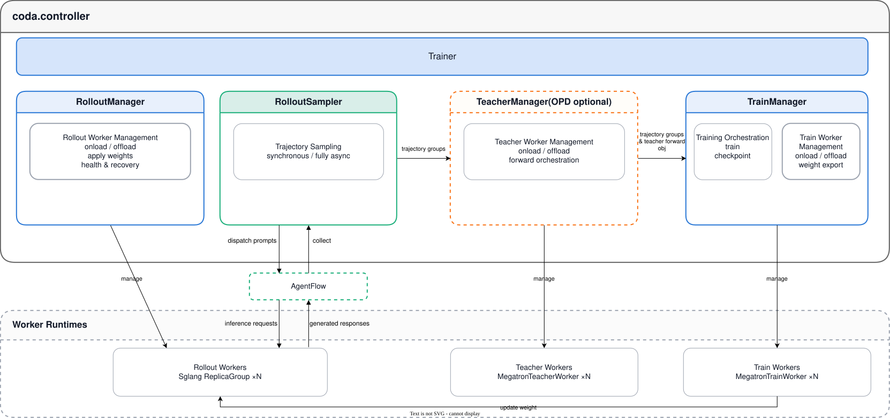

# Single Controller

`coda.controller` is LoongSage's control plane. It orchestrates the execution order of rollout, Teacher inference, training, checkpointing, and weight updates. The Controller does not run model forward passes or parameter updates itself; instead it manages the lifecycle of the relevant Workers and coordinates the data, resources, and transfer capabilities provided by other modules.

This page has three parts: [Overview](#overview) covers the package boundary and internal architecture, [Core Components](#core-components) walks through `Trainer` and the Managers, and [Execution Flow](#execution-flow) describes how a step is orchestrated in each run mode.
For launch methods and choosing a run mode, see the [Run Guide](run-guide.md).

## Overview

### Package Responsibilities

- Parse and validate Controller-related configuration.
- Create and hold the Managers each run mode needs: `TrainManager` is always created,
  `TeacherManager` only when `opd.enable=true`, and `RolloutManager` is skipped entirely under
  `run_mode=train-only`.
- Schedule data sampling, trajectory processing, and training batch splitting.
- Schedule periodic evaluation within the synchronous flow and report evaluation metrics.
- Orchestrate synchronous training, fully asynchronous training, rollout-only, and train-only flows.
- Coordinate checkpoints, weight versions, and train-to-inference weight updates.
- Handle offload and onload of different Workers in colocated scenarios.

The Controller is not responsible for implementing the Agent, data sources, GPU resource scheduling, model backends, or the weight transfer protocol; those capabilities are provided by other LoongSage packages.

### Files in the Package

`coda.controller` is made up of the following core source files:

| File | Core Objects | Role |
| --- | --- | --- |
| `trainer.py` | `Trainer`, `Mode` | Top-level entry point and training-flow orchestration |
| `rollout_sampler.py` | `RolloutSampler`, `SlidingWindowStrategy` | Sampling coordination, evaluation coordination, and the fully-async sliding-window strategy |
| `rollout_manager.py` | `RolloutManager` | Rollout Worker lifecycle management |
| `train_manager.py` | `TrainManager` | Train Worker lifecycle management |
| `teacher_manager.py` | `TeacherManager` | OPD Teacher Worker lifecycle management |

### Controller Internal Architecture

#### Component Hierarchy



Arrows in the diagram mark the direction of a call or data flow:

- Horizontal edges between Managers are collaboration within the training loop: trajectory groups are dispatched from `RolloutSampler`, pick up Teacher forward results at `TeacherManager`, and land in `TrainManager`.
- The vertical `manage` edges from a Manager down to the Worker pools are lifecycle management — the point where the control plane acts on Worker execution.
- The `update weight` edge from `Train Workers` to `Rollout Workers` is the weight data plane: weights travel over `TransferMeshChannel` directly from the training Workers to the Rollout Workers.

Worker internals are not expanded in the diagram.

#### Object-Holding Relationships

`Trainer` is the only top-level orchestrator. Its initialization establishes the following holding relationships:

```text
Trainer
|-- scheduler          -> ResourceScheduler (cross-package)
|-- datasources[]      -> RolloutDataSourceWithBuffer (cross-package)
|-- train_manager      -> TrainManager
|-- teacher_manager    -> TeacherManager | None
|-- rollout_manager    -> RolloutManager
`-- rollout_sampler    -> RolloutSampler
                         |-- agentflow (cross-package)
                         |-- traj_queue (cross-package, held by AgentFlow)
                         |-- data_filter (cross-package)
                         |-- pipeline_buf (cross-package, fully-async only)
                         `-- _strategy (within Controller, fully-async only)
```

Here "holding" denotes object references within the Controller's lifecycle, not class inheritance. The three Managers have no direct dependencies on each other; they are coordinated by `Trainer` according to execution phase.

See [Core Components](#core-components) for detailed responsibilities, internal coordination flows, and cross-package dependencies of each component.

## Core Components

This page walks through the core classes defined in the `coda.controller` package, covering the design details of orchestration, sampling coordination, and Worker management. The final section lists the cross-package components they depend on.

### Trainer

Source: [coda/controller/trainer.py](../../coda/controller/trainer.py)

`Trainer` is LoongSage's top-level orchestrator and also the module entry point for Hydra. It does not implement any specific rollout or training algorithm; instead it organizes the individual phases according to configuration.

#### Initialization Responsibilities

`Trainer.__init__` does four things, in this order:

- **Config validation**: validate the combined constraints across `colocate`, `fully_async`, and the data sources.
- **Dependency construction**: initialize tracking, then create the `ResourceScheduler`, the data sources, and the `AgentFlow`.
- **Manager assembly**: `TrainManager` → optional `TeacherManager` (when `opd.enable=true`) →
  `RolloutManager` + `RolloutSampler` (both stay `None` under `run_mode=train-only`).
- **Weight channel bootstrap**: obtain the gloo master address and port for later `ChannelMeta` construction.

#### Training Responsibilities

`Trainer` is the orchestration entry point for each training step. It drives the rollout, optional Teacher, training, and weight-update phases according to `run_mode`, and it also handles the on-disk data handoff between `rollout-only` and `train-only` modes, as well as recovery of step and data-source state.

The step-internal execution order of each phase is not expanded on this page; see [Execution Flow](#execution-flow).

### RolloutManager

Source: [coda/controller/rollout_manager.py](../../coda/controller/rollout_manager.py)

`RolloutManager` manages the rollout-side resources, made of one or more inference replica groups. The number of Rollout Workers and the GPU layout in each replica group are determined by the rollout configuration.

#### Main Responsibilities

The three Worker-side Managers share one set of responsibility categories: **Actor topology construction**, **Worker call proxying**, **GPU memory lifecycle**, **weight synchronization**, **fault handling**, **forward computation**. Categories a Manager does not have are simply omitted.

- **Actor topology construction**: build the `ReplicaGroup`s and `SglangEngine` Ray Actors per the `regular` / `prefill` / `decode` entries in `rollout.sglang_replicas`.
- **Worker call proxying**: forward control calls to every Rollout Worker and collect the results.
- **GPU memory lifecycle**: offload releases all GPU memory; onload supports restoring weights and KV cache in separate stages.
- **Weight synchronization**: act as the receiver side, dispatching a `ChannelMeta` carrying `engine_id` and `weight_version` to each Rollout Worker.
- **Fault handling**: probe liveness via `RolloutHealthMonitor`, rebuild lost Rollout Workers, and tell `Trainer` whether the transfer channel must be rebuilt.

#### Component Relationships

```text
RolloutManager
    |
    +-- replica_groups: list[ReplicaGroup]
    |       `-- all_engines: SglangEngine x N (Ray Actors)
    |
    `-- _health_monitors: list[RolloutHealthMonitor]
            (created only when rollout.use_fault_tolerance=true, one per ReplicaGroup)
```

`Router` is not part of `ReplicaGroup`, and it is not created by `RolloutManager`. The Router is defined in `coda.agentflow` and held by `AgentFlow`; `ReplicaGroup` only forwards the `agentflow.router` ip and port to each Rollout Worker, which registers itself with the Router after startup.

`RolloutManager` is not responsible for generating prompts, nor for deciding how many trajectories a step needs; those policies belong to `RolloutSampler` and the data sources.

### TrainManager

Source: [coda/controller/train_manager.py](../../coda/controller/train_manager.py)

`TrainManager` manages the Ray Actor pool on the training side. The current implementation creates `MegatronTrainWorker` instances based on `trainer.backend`, one Actor per GPU rank.

#### Main Responsibilities

- **Actor topology construction**: create one `MegatronTrainWorker` Actor per rank across the training world size.
- **Worker call proxying**: forward init, train, save_model, update_weights, and similar calls to every rank, returning handles that `Trainer` decides when to wait on.
- **GPU memory lifecycle**: move parameters and optimizer state between GPU and CPU in colocated mode.
- **Weight synchronization**: act as the sender side, accepting the `ChannelMeta` and writing weights into the `TransferMeshChannel`.

Training parallelism is determined jointly by Megatron configuration and LoongSage trainer configuration. The Controller only manages the lifecycle of the Worker pool; it does not replace Megatron's implementation of TP, PP, CP, EP, DP, or other parallelism strategies. Any non-`megatron` backend currently raises an error.

### TeacherManager

Source: [coda/controller/teacher_manager.py](../../coda/controller/teacher_manager.py)

`TeacherManager` is the optional controller used in OPD (Online Policy Distillation) scenarios. `Trainer` only creates it when `opd.enable=true`.

#### Main Responsibilities

- **Actor topology construction**: partition `opd.teachers` into groups by Teacher parallelism, with one set of `MegatronTeacherWorker` Actors per group.
- **Worker call proxying**: forward init, onload, offload, and compute_teacher to every Teacher Actor.
- **GPU memory lifecycle**: stagger GPU memory usage against training and rollout in colocated mode.
- **Forward computation**: `compute_teacher()` runs the Teacher forward pass over the DP shards handed in by `Trainer` and attaches the result references to the matching shards.

`compute_teacher()` does not produce a new batch object; it augments the DP shard references the Trainer has already split in place. The only difference between OPD enabled and disabled is therefore whether each shard carries a `teacher_worker_ref`.

`TeacherManager` uses a resource-management approach similar to `TrainManager`, but the two have different lifecycles and configuration semantics. A Teacher is not an alias of a regular training Worker, and it should not appear in the main training path when OPD is disabled.

### RolloutSampler

Source: [coda/controller/rollout_sampler.py](../../coda/controller/rollout_sampler.py)

`RolloutSampler` connects the data sources, AgentFlow, and the Trainer. It converts "which data should be sampled in this step" into "a list of `TrajectoryGroup` ready to be consumed by training".

#### Main Responsibilities

`RolloutSampler` manages no Workers; its responsibilities are organized by data-pipeline stage:

- **Data source consumption**: pull this step's prompt groups from each `RolloutDataSourceWithBuffer` and decide how many to refill.
- **Task dispatch**: create one `AgentFlow.generate()` task per prompt group.
- **Trajectory aggregation**: consume trajectory groups from AgentFlow's `TrajQueue` once they are complete per prompt.
- **Admission filtering**: use `DataFilter` to decide whether a trajectory group enters training, and aggregate sampling metrics.
- **Evaluation coordination**: on an evaluation round, dispatch the evaluation sets alongside the training rollout, route evaluation trajectories out of the training batch, and report the aggregated `eval/*` metrics.
- **Thread and backpressure control**: in fully async mode, run the rollout and collector threads, gate the dispatch quota by the `PipelineBuffer` watermark, and maintain pause / resume / stop state.

`RolloutSampler` is not responsible for the final DP split of distributed training batches; that step is performed by `Trainer` via the data processor.

#### Sampling Coordination

Synchronous and fully asynchronous modes share the same data-processing logic but differ in scheduling:

```text
Synchronous mode
Trainer -> RolloutSampler.__call__()
        -> dynamic_rollout()
        -> returns TrajectoryGroup[]

Fully asynchronous mode
Trainer main thread              rollout thread             collector thread
     |                                 |                            |
     |                         rollout_loop()                       |
     |                                 |                            |
     |                    SlidingWindowStrategy                     |
     |                    computes dispatchable groups              |
     |                                 |                            |
     |                           AgentFlow tasks                    |
     |                                 |                            |
     |                                 `------> TrajQueue ----------+
     |                                                              |
     `---------------- async_get() <--- PipelineBuffer <--- complete groups
```

The fully asynchronous scheduling strategy is produced by `create_strategy()` from `fully_async.sliding_window` and serialized across threads by `_ThreadSafeStrategy`:

- `no-window`: fills tasks up to the maximum in-flight capacity.
- `window-gated`: uses window gating to limit dispatch.
- `windowed-fifo`: manages sequences with window and FIFO semantics.

`RolloutSampler` also maintains pause, resume, stop, cleanup, and fatal-error states so that background-thread exceptions and stop signals can propagate to the training main thread.

### Cross-Package Collaborators

The following components are not part of the `coda.controller` package; this directory only describes how the Controller collaborates with them:

| Component | Owning Module | Collaboration in the Controller |
| --- | --- | --- |
| `ResourceScheduler` | `coda.resource_scheduler` | Creates the Ray placement group and allocates GPU bundles for each Manager's Actors |
| `RolloutDataSourceWithBuffer` | `coda.data_factory` | Provides prompts, cursors, and unused-prompt buffer state |
| `AgentFlow` | `coda.agentflow` | Runs the Agent, holds the Router and `TrajQueue`, drives SGLang inference, and produces trajectories |
| `DataFilter` | `coda.data_factory` | Used by `RolloutSampler` to filter trajectory groups |
| `PipelineBuffer` | `coda.utils` | Connects the fully-async rollout producer thread and the training consumer thread |
| `eval_utils` | `coda.utils` | Called by `RolloutSampler` on evaluation rounds to aggregate evaluation trajectories into `eval/*` metrics |
| `ReplicaGroup` / `SglangEngine` | `coda.backends` | Host the SGLang rollout replicas and Rollout Worker Ray Actors |
| `MegatronTrainWorker` / `MegatronTeacherWorker` | `coda.backends` | Execute training and Teacher forward passes |
| `RolloutHealthMonitor` | `coda.utils` | Used by `RolloutManager` for Rollout Worker health checks |
| `TransferMeshChannel` | `coda.transfer_mesh` | Transfers weights between Train Workers and Rollout Workers |

The detailed design and APIs of these components are maintained in their respective module documentation directories.

## Execution Flow

### Startup

The Controller's entry point is `coda.controller.trainer`. Once launched, `Trainer` first completes configuration and resource initialization, and then enters the specified run mode.

### Full Synchronous Flow

When `run_mode=default` and fully async is not enabled, the logical order of one training step is:

```text
1. Fetch prompts from the data sources
2. RolloutSampler invokes AgentFlow to sample training and evaluation prompts
3. TrajQueue aggregates complete TrajectoryGroups
4. DataFilter filters trajectories
5. Trainer splits the batch by DP
6. Optional Teacher / OPD computation
7. TrainManager invokes MegatronTrainWorker
8. Save checkpoint and metrics
9. Update SGLang rollout weights and weight_version
10. Move to the next step
```

### Periodic Evaluation Flow

Evaluation has no dedicated run mode; it runs inside the synchronous rollout. Each step first decides whether this round is an evaluation round:

```text
                              step
                                |
                                v
   interval > 0 and (step % interval == 0 or step == 1 or step == total_steps)?
                 |                                        |
                no                                       yes
                 |                                        |
                 v                                        v
     dispatch training prompts only     training prompts + the whole evaluation set
                                                          |
                                                          v
                                  evaluation trajectories routed out by is_eval
                                        and aggregated into eval metrics
```

Evaluation trajectories inherit the `ds_index` of their parent training source and are distinguished from training trajectories only by `is_eval` and the `_eval` segment in the trajectory id.

Evaluation groups never enter the training path: they are not filtered, do not count toward quota or refill, and are not included in `rollout/*` metrics. Leftover evaluation trajectories are dropped during cleanup, so the evaluation set is never restored into the data-source buffer and consumed as training data.

#### Currently Unsupported Scenarios

- There is no periodic evaluation when `fully_async.enable=true`. In fully asynchronous mode the rollout runs in a background thread and does not go through `dynamic_rollout`.
- `rollout.sampler.name=keeporder` is not implemented and does not involve evaluation either.

### Fully Asynchronous Flow

When `fully_async.enable=true`, `Trainer` starts a background rollout thread. Rollout and training no longer strictly alternate step by step; instead they form a pipeline through `PipelineBuffer`:

```text
background rollout thread                training main thread
       |                                     |
       v                                     |
read data source -> AgentFlow -> TrajQueue   |
       |                                     |
       v                                     |
collect complete trajectories                |
     -> PipelineBuffer ---------------------+--> async_get()
                                             |
                                             v
                                    DP split -> training batch
                                             |
                                             v
                                      Megatron training
```

The sampler maintains the following states in the background thread:

- `pause`: stop dispatching new rollouts and, based on partial-rollout configuration, clean up in-flight tasks.
- `resume`: reopen the gate and continue producing rollouts.
- `stop`: notify the producer thread to exit and propagate the termination state to the training loop.
- fatal error: hand unrecoverable exceptions from the background thread over to the training main loop.

Fully asynchronous mode has stricter configuration constraints than synchronous mode. See [Fully Async Mode](fully-async-mode.md) for the full list of parameters and constraints; at runtime, `Trainer._validate_config()` and the current configuration file are the source of truth.

### Rollout-only

`run_mode=rollout-only` only executes sampling and trajectory preprocessing; it does not create the final consumer step of the training-update path:

```text
data source -> RolloutSampler -> filter -> DP split -> on-disk batch
```

Before saving, `Trainer` stamps the trajectories with the current `weight_version` and organizes the data according to the DP structure expected by training. This mode is suitable for pre-generating rollout data that will later be reused via `train-only`.

Rollout-only does not mean the training backend configuration can be omitted. Data splitting and batch shape still depend on the trainer's parallelism, mini-batch, and related configuration.

### Train-only

`run_mode=train-only` loads previously saved batches from disk and does not run rollout:

```text
on-disk batch
    -> restore data source / step
    -> load and place into Ray by DP
    -> TrainManager
    -> MegatronTrainWorker
    -> checkpoint / metrics
```

Train-only creates neither `RolloutManager` nor `RolloutSampler`, so there is no weight-transfer
channel and no `_update_weights` call anywhere in the flow; `_post_train_weight_version()` only
advances the `weight_version` counter for checkpoint bookkeeping. It requires the on-disk data
structure to be compatible with the current training configuration, including DP splitting,
mini-batch, and trajectory fields.

### Trajectory to Training Batch

`Trainer` uses the data processor to convert the `TrajectoryGroup`s returned by the sampler into training input:

```text
list of TrajectoryGroup
        |
        +--> stamp the current weight_version
        +--> compute total trajectories
        +--> compute the number of mini-batches
        +--> split_traj_group_by_dp(...)
        `--> put_dp_shards_to_ray(...)
                         |
                         v
                   list of Ray ObjectRef
```

In full training mode, Ray ObjectRefs are passed to the training Workers. In rollout-only mode, DP shards are written to disk and an empty list is returned. In train-only mode, on-disk batches are restored as Ray references.

When OPD is enabled, `TeacherManager.compute_teacher()` runs after this step. It does not rebuild the batch; it appends the ObjectRefs of the Teacher forward results to each DP shard's `teacher_worker_ref` field.

### Weight-Update Flow

`_update_weights()` is only reached under `run_mode=default` and `rollout-only` (`train-only` has no
rollout side and skips this flow entirely). `Trainer` fires updates to both the training side and the
rollout side with the same `ChannelMeta` and waits for both to finish:

```text
Trainer._update_weights(meta, weight_version)
  |
  +--> TrainManager.async_update_weights(meta)      -> training Workers export weights
  |
  `--> RolloutManager.async_update_weights(meta, v) -> one ChannelMeta per Rollout Worker
                     |
                     v
     weights travel to Rollout Workers over TransferMeshChannel
                     |
                     v
        Rollout-Worker-side weight_version = v
```

### Recovery and Checkpoint

The goal of the recovery flow is not only to load the model, but also to restore the data-consumption position:

1. Read the training checkpoint and step.
2. Restore each data source's cursor and its replay/buffer state.
3. Initialize the current `weight_version`.
4. Rebuild Workers and the weight-transfer channel.
5. Let rollout and training continue with a consistent model version.

The relevant implementation lives in [trainer.py](../../coda/controller/trainer.py) and [checkpoint_utils.py](../../coda/utils/checkpoint_utils.py).

### Run-Mode Comparison

For configuration parameters and usage of each run mode, see [Config Reference - Top-level runtime](config-reference.md#1-top-level-runtime). The table below adds an execution-perspective view of the weight-behavior differences:

| Configuration | Rollout | Training | Weight Behavior | Periodic Evaluation |
| --- | --- | --- | --- | --- |
| `run_mode=default` | Executed per step | Executed | Weights are synced to Rollout Workers after each training pass | Supported |
| `run_mode=default` + `fully_async.enable=true` | Executed in background | Executed | Post-training weights are pushed to Rollout Workers through the async flow | Not supported |
| `run_mode=rollout-only` | Executed | Not executed | Initial weights are synced once at startup; no new weights are produced | Supported, but always against the initial weights |
| `run_mode=train-only` | Not executed | Executed | No transfer channel and no weight update at all; new training weights are only written to disk | Not executed (no rollout phase) |
