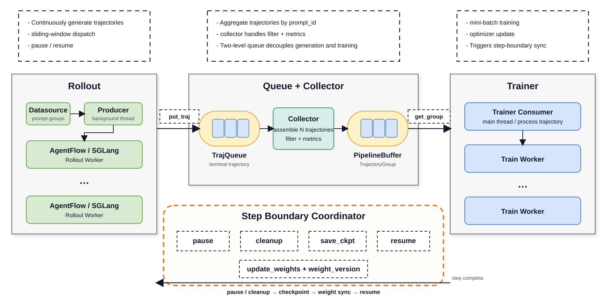

# Fully Async Mode

Fully async mode deploys rollout (sampling) and training on independent machine resources. Rollout continuously generates trajectories in the background, and the training pipeline can start training immediately once a mini-batch is fetched from the buffer. Compared with the default "train the whole batch only after the whole rollout batch completes," this mode overlaps sampling and training, reducing idle time on both types of GPUs. The benefit is especially significant for tasks where sampling and training take comparable time under colocate mode.

Note that "fully async" does not mean there is no synchronization boundary at all between training, weight update, and checkpoint saving. At the end of each training step, the system still pauses rollout, cleans up or waits for outstanding requests, decides whether to save a checkpoint based on `trainer.save_freq`, syncs the new weights to the inference engine, and then resumes background production. `stale_steps` is used to enlarge the upper bound on the number of currently unconsumed trajectory groups. The larger this value, the more off-policy the trajectories can potentially be. Since the weights used by rollout and training may differ, it is recommended to combine with off-policy protection mechanisms such as IS correction, M2PO, or OPSM.

It is recommended to use [conf/qwen3_30b_a3b/dapo_h20_1node.yaml](../../conf/qwen3_30b_a3b/dapo_h20_1node.yaml) as the starting configuration. Before running, replace `hf_model_path`, `prompt_data_path`, `checkpoint_path`, the tracking address, and the GPU topology inside, and switch `colocate` to `false` (that example is colocated by default):

```bash
python -m coda.controller.trainer --config-name qwen3_30b_a3b/dapo_h20_1node \
  colocate=false fully_async.enable=true
```

## 1. Key Parameters

The table below summarizes the fully-async switch, parameters directly involved in async scheduling, and related parameters that affect step-boundary cleanup behavior. The following symbols are used throughout: `B` denotes `data_sources[0].num_prompts_per_step`, `N` denotes `data_sources[0].num_trajectories_per_prompt`, and `M` denotes `trainer.mini_batch_size`.

| Parameter | Default | Description | Constraints or Recommendations |
| --- | ---: | --- | --- |
| `fully_async.enable` | `false` | Whether to enable the fully-async training pipeline. Once enabled, a background rollout producer, collector, and `PipelineBuffer` are created. | Must be used together with `colocate: false`. |
| `fully_async.sliding_window` | `no-window` | Controls prompt group dispatch and collection strategy. Options: `no-window`, `window-gated`, `windowed-fifo`. | See Section 3 for how to choose. |
| `fully_async.stale_steps` | `0` | Additional pipeline capacity expressed as a multiple of the training step. All three built-in strategies use this value. | Must be `>= 0`; can be fractional; the final capacity is obtained via `int(...)` floor. |
| `colocate` | `true` | Whether rollout and trainer share the same GPU pool. | Must be set to `false` for fully-async, so the cluster needs to host both trainer GPUs and rollout GPUs. |
| `run_mode` | `default` | Entry mode. | Fully-async only supports `default`; `train-only` and `rollout-only` are not supported. |
| `data_sources` | `[${data_source}]` | The list of data sources actually used. | Fully-async currently supports only a single data source. |
| `data_source.num_prompts_per_step` | `64` | The number of prompt groups `B` planned to be consumed per training step, and also the base batch size of the sliding window. Each group contains `N` trajectories. | `B × N` must be divisible by `M`, otherwise an error is raised. |
| `trainer.mini_batch_size` | `64` | Each time, `M // N` complete groups are fetched from the `PipelineBuffer` and a training call is issued. | It is recommended that `M % N == 0` and `(B × N) % M == 0`. |
| `trainer.num_nodes`, `trainer.num_gpus_per_node` | `1`, `8` | Defines the resident training GPU pool. | The total training GPU count is their product and is not shared with rollout. |
| `rollout.num_gpus_per_node`, `rollout.sglang_replicas.*` | See default config | Defines the resident SGLang GPU pool, the number of replicas, and the GPU count per replica. | Total rollout GPU count is the sum of `num_nodes × rollout.num_gpus_per_node` for each replica type. |
| `rollout.sampler.num_oversample` | `0` | Additional dispatch amount used by synchronous dynamic sampling. | Must be `0` in fully-async; additional in-flight capacity is uniformly controlled by `stale_steps`. |
| `rollout.partial` | `false` | Whether to abort in-progress requests at the step boundary. When set to `true`, requests are cancelled and complete groups are put back into the datasource buffer; when set to `false`, all in-flight requests are waited on before recycling. | For long trajectories or multi-turn agents, `true` is generally recommended to reduce pipeline bubbles caused by long-tail trajectories. |
| `rollout.mask_offpolicy_in_partial_rollout` | `false` | When restoring a partial trajectory, set the `loss_mask` to 0 for response tokens already generated by older versions. | Can only be enabled when `rollout.partial: true`. |
| `rollout.sglang_args.max_running_requests`, `agentflow.router.max_connections` | The latter is `512` | Limits the concurrency of the inference service and the Router respectively. | These are performance tuning options, to be configured together with the maximum trajectory scale of `B × N` and the number of multi-turn requests per trajectory. |
| `algorithm.m2po.*` | Off by default | Filters tokens with the largest bias based on the second moment of `old_log_probs - rollout_log_probs`. | Cannot be used together with `trainer.use_rollout_log_probs: true`. |
| `algorithm.opsm.*` | Off by default | When advantage is negative and sequence KL exceeds a threshold, masks out the gradient for that sequence. | Can be combined with other off-policy protection mechanisms; the example configuration above only enables IS correction, so M2PO and OPSM have to be turned on as needed. |

The capacity semantics of `fully_async.stale_steps` are as follows:

```text
capacity = int(B * (1 + stale_steps))
```

For example, when `B=64` and `stale_steps=1.0`, the capacity is 128 prompt groups, covering up to about 2 training steps worth of prompts. The number of trajectories per group is still determined by `N`. Increasing this parameter typically improves pipeline fill rate, but also increases the risk of policy staleness.

## 2. Principles

Fully-async mode consists of three concurrent entities:

1. **rollout producer**: Runs in an independent thread and its event loop, reads prompt groups from the datasource, and dispatches them to AgentFlow according to the sliding window strategy. AgentFlow then interfaces with the inference engine.
2. **collector**: Runs in another background thread. When each terminal trajectory completes (success, failure, or cancellation), it first enters `TrajQueue`; the collector waits for `N` trajectories of the same prompt to be assembled, then after strategy checks, performs filtering and statistics, and finally writes the valid complete group into `PipelineBuffer`.
3. **trainer consumer**: Runs in the main thread. Each time it fetches `M // N` groups from `PipelineBuffer`, assembles them into training data, and executes one optimizer update; a single outer step performs `(B × N) // M` training calls in total.

The two-level queue decouples "trajectory completion" from "training consumption":

- `TrajQueue`: AgentFlow → collector. Aggregates single trajectories by `prompt_id`; a group can only be dequeued once fully assembled.
- `PipelineBuffer`: collector → trainer. Holds completed and filtered `TrajectoryGroup`s, and consumes by priority based on the epoch/prompt sequence in the `prompt_id`.



The synchronization relationships within a single training step are as follows:

1. The producer and collector run continuously; the trainer waits and consumes completed groups as needed, then performs a number of mini-batch updates.
2. After the trainer finishes `(B × N) // M` fetch-and-train iterations, it calls `pause()`. Under the recommended divisible configuration, exactly `B × N` trajectories have been consumed at this point. The producer stops dispatching new requests and, based on `rollout.partial`, either cancels or waits for unfinished requests; complete groups already written into `PipelineBuffer` by the collector are not cleared and can be used in the next step.
3. Once cleanup finishes, the system aggregates rollout metrics for this step, decides whether to save a checkpoint based on `trainer.save_freq` (when saving, the yet-unconsumed prompts in the `PipelineBuffer` are additionally recorded so that they can be regenerated after recovery), and syncs the latest model weights. SGLang flushes the prefix/KV cache corresponding to the old weights before the update.
4. `resume()` increments the rollout step by one; the newly synced weights are also exposed to SGLang with an incremented `weight_version`, and the producer resumes production afterwards. The version returned by SGLang is recorded in the version fields of each generated token as well as the start/end fields of the trajectory, used for monitoring and off-policy correction.

On the training side, multiple optimizer updates may be performed within the same step. When `old_log_probs` is first computed, the system saves the `old_actor` snapshot for that step; subsequent mini-batches temporarily switch back to that snapshot to compute the behavior policy probability, then switch back to the continuously updated actor, thereby avoiding drift of the old policy across mini-batches within the same step.

## 3. Sliding Window Strategies

All three strategies count in prompt groups. Let:

- `R`: number of groups already dispatched but not yet collected by the collector;
- `Q`: number of completed groups in `PipelineBuffer` not yet consumed by the trainer;
- `C = int(B × (1 + stale_steps))`.

| Strategy | Dispatch Constraint | Collection Constraint | Main Trade-off |
| --- | --- | --- | --- |
| `no-window` | `R + Q <= C` | Any completed group | Throughput-first, largest deviation in completion order |
| `window-gated` | `R + Q <= C`, and the next dispatch sequence number minus the oldest uncollected sequence number is less than `C` | Any completed group | Limits how far slow samples can be crossed at the source |
| `windowed-fifo` | `R + Q <= C` | Only collects the first `B` sequence numbers starting from the current oldest uncompleted sequence number | Aggressive dispatch, but training sample order is closer to FIFO |

Beyond the three built-in strategies, you can register your own — see the [Custom Sliding Window Strategy Development Guide](./custom-sliding-window.md).

### 3.1. no-window

`no-window` only controls total capacity:

```text
dispatch_count = max(0, C - R - Q)
```

Any complete group that finishes first can enter `PipelineBuffer`. Therefore, slow requests do not block subsequent prompts, and this usually achieves the highest GPU utilization; however, training data will be more biased towards easy-to-complete or shorter samples, and it has the weakest preservation of the original data order.

Applicable scenarios: throughput-first tasks, tasks with fairly uniform lengths, tasks insensitive to data order, or tasks with strong off-policy corrections already enabled. Under this strategy, `stale_steps` directly represents the additional global in-flight/buffer capacity.

### 3.2. window-gated

`window-gated` assigns a monotonically increasing sequence number to each dispatched group, and imposes both of the following constraints:

```text
next_seq - oldest_uncollected_seq < C
R + Q <= C
```

If the earliest prompt in the window takes a long time to complete, even if subsequent prompts have completed and been consumed, new prompts cannot be continuously dispatched. Only after the earliest uncompleted sequence number moves forward can the window continue to slide; on the collection side, any completed group within the window is still allowed to enter `PipelineBuffer`.

Applicable scenarios: cases that need to limit the maximum distance by which a request can be crossed by subsequent data, reducing sampling bias caused by variance in completion time, while still allowing out-of-order completion within the window. The cost is that a single extremely slow group can reduce rollout utilization. Under this strategy, `stale_steps` directly enlarges the window between "earliest uncompleted sequence number" and "next-to-dispatch sequence number."

### 3.3. windowed-fifo

`windowed-fifo` has the same dispatch capacity as `no-window`, i.e., `R + Q <= C`; the difference lies on the collection side. Suppose the current earliest uncompleted sequence number is `min_seq`; only complete groups satisfying the following can pass from `TrajQueue` into `PipelineBuffer`:

```text
seq - min_seq < B
```

Therefore, this strategy is not strictly item-by-item FIFO, but rather **uses one training step's prompt count `B` as the collection window**: out-of-order completion is still allowed inside the window; groups outside the window remain in `TrajQueue` even if they finish first, until the front of the window slides forward.

Applicable scenarios: cases where the training order should be closer to the original dataset order, or that want to reduce bias introduced by short samples entering training first, while not wanting to restrict subsequent request dispatch as strictly as `window-gated`. `stale_steps` only enlarges the total dispatch capacity `C`; the collection window is always `B` and does not change with `stale_steps`. Note that completed groups outside the window stay in `TrajQueue`, still count against `R` and total capacity, occupy queue memory, and may cause head-of-line blocking.

## 4. Statistics and Metrics

Fully-async mode reports the following new or noteworthy metrics after `pause()` completes at each step:

| Metric | Meaning | Interpretation |
| --- | --- | --- |
| `rollout/pipeline_buf_size` | Number of complete prompt groups in `PipelineBuffer` still unconsumed by the trainer, measured at the moment step-boundary cleanup finishes. | If this stays at 0 for a long time while `timing/rollout` is high, the trainer is frequently waiting for data; if it remains large, rollout production is ahead, and policy staleness and memory usage may rise. |
| `rollout/filter_drop` | Number of prompt groups dropped by the collector via `rollout.filter` during this step (unified across synchronous dynamic sampling and fully-async). | If persistently high, check reward/status filter conditions and data quality. |
| `rollout/partial_ratio` | The proportion of trajectories consumed by the trainer in this step whose first and last generated responses use different `weight_version`. | Measures whether a single trajectory crosses a weight update boundary; a value of 0 does not equate to fully on-policy, only that the start/end versions did not change. |
| `rollout/partial_span_max` | The maximum value of `end_rollout_weight_version - start_rollout_weight_version` among consumed trajectories in this step. | Greater than 1 means at least one trajectory crossed multiple weight versions; partial recovery and off-policy correction should be examined. |
| `rollout/partial_restored_count` | The number of trajectories put back into the datasource buffer that belong to complete prompt groups during step cleanup; only reported when there is data to recycle. | "Complete" means `N` trajectories of the same prompt have been assembled, not that each trajectory has finished generating. This value divided by `N` is the number of restored groups. |
| `rollout/partial_dropped_incomplete_count` | The number of trajectories dropped during step cleanup because `N` had not been assembled and could not be recovered; only reported when there is data to recycle. | A high value means step boundaries frequently interrupt partial trajectories of the same prompt. |
| `timing/pause_delay` | Total time spent after the trainer issues pause, waiting for the producer to cancel or await requests, clear `TrajQueue`, and reset the strategy. | When `rollout.partial: false`, this metric also includes the time waiting for all in-flight requests to complete, which can be large. |
| `perf/wait_ratio` | Fraction of `wait + timing/train` the trainer spent **not training**, i.e. `wait / (wait + timing/train)`. Here `wait` is accumulated outside the training block via an `inverse_timer` (data fetch, trajectory processing, teacher, flush, pause, etc.); it is used only to derive this ratio and is not reported on its own. | Higher values mean the trainer is frequently starved by rollout production; consider raising rollout concurrency or relaxing staleness. |

Additionally, in fully-async mode, `timing/rollout`, `timing/process_traj`, `timing/teacher` (if enabled), and `timing/train` denote the **cumulative time** of all mini-batch calls within an outer step; `timing/step`, `timing/save_ckpt`, and `timing/update_weights` are still recorded per outer step.

Compared with colocate/synchronous mode, the following metrics differ in how they are computed or in what they mean:

- `rollout/partial_ratio` and `rollout/partial_span_max`: in synchronous mode they are computed over the currently accepted groups of the whole batch; in fully-async mode they are computed over the trajectories actually fetched from `PipelineBuffer` for this step.
- Training metrics such as `train/loss`, `train/pg_loss`, `train/entropy`, `train/grad_norm`, `train/approx_kl`, `train/clip_ratio`, `train/dual_clip_ratio`, `train/nan_ratio`, and `train/is_*`: in fully-async mode, one step trains multiple mini-batches, so the worker first caches each reported value and aggregates them at step end purely by naming rule — `timing/*` are summed, keys ending in `_max` take the max, keys ending in `_min` take the min, and everything else is averaged; `perf/train_memory_allocated_max` and `perf/train_memory_reserved_max` therefore take the max. Synchronous/colocate mode typically reports the result of a single training call directly.
- `timing/rollout`: in fully-async mode, this metric mainly represents the cumulative wall-clock time the trainer spends waiting on `PipelineBuffer` and fetching data, not the time for the background inference engine to complete a whole batch of generation. It should therefore be analyzed together with buffer size and pause delay.
- Fully-async mode does not execute the `offload_rollout`, `onload_train`, `offload_train`, `onload_rollout_weights`, and `onload_rollout_kv` stages of colocate mode, so the corresponding timing metrics are not produced. Fully-async mode keeps models resident on independent GPUs and directly updates the rollout weights at the step boundary.

## 5. Experimental Results

### 5.1. Experimental Setup

* Machine: 2 × H20 (16 GPUs total)
* Model: Qwen3-30B-A3B (bf16, TP=4, PP=2, EP=4)
* Algorithm: GRPO + IS correction + M2PO + OPSM
* Dataset: dapo-math-17K
* Rollout length: `max_response_length = 20K` tokens
* Engine: SGLang + Megatron
* `num_prompts_per_step = 64`, `num_trajectories_per_prompt = 8`, `mini_batch_size = 128`
* Total steps: 100

**Resource allocation**:

* `colocate` mode: all 16 GPUs simultaneously host both trainer and rollout.
* `fully_async` mode: `trainer.num_nodes = 1` (8 GPUs) + `rollout.sglang_replicas.regular.num_nodes = 1` (8 GPUs, `num_gpus_per_replica = 4`, 2 replicas in total).

All fully-async experiments set `rollout.partial = true` and `rollout.mask_offpolicy_in_partial_rollout = true`. Because step 0 additionally needs to complete the first-round prefix cache warmup on the SGLang side, KV cache initialization, and the initial fill of the fully-async buffer, its cost is significantly higher than steady state; therefore, below we report both the full 100-step and the 99-step (excluding step 0) speedup numbers.

### 5.2. Fully-async vs. colocate

| config | resource | avg step (100 steps) | speedup | avg step (excl. step 0) | speedup (excl. step 0) |
|:---:|:---:|:---:|:---:|:---:|:---:|
| colocate | 16 | 580.79 | 1.00x | 578.63 | 1.00x |
| colocate + partial | 16 | 489.63 | 1.19x | 486.34 | 1.19x |
| fully_async (no-window, stale = 1.0) | 8:8 | 454.50 | 1.28x | 451.74 | 1.28x |
| fully_async (windowed-fifo, stale = 1.0) | 8:8 | 434.76 | 1.34x | 424.30 | 1.36x |
| fully_async (windowed-fifo, stale = 2.0) | 8:8 | 428.76 | 1.36x | 414.58 | 1.40x |

Under the best configuration (`windowed-fifo`, `stale_steps = 2.0`), the end-to-end 100-step average per-step time drops from 580.79s to 428.76s (1.36x); excluding the cold-start overhead of the first step, the steady-state speedup reaches 1.40x. Compared with the colocate baseline that also enables partial rollout, the steady-state average per-step time is reduced by about 15%.

### 5.3. Sliding Window Strategy Ablation

Fixing `stale_steps = 1.0`, 8:8 resource allocation, and `rollout.partial = true`, we switch `sliding_window` and align the comparison with colocate:

|         config          | avg step (100) | speedup | avg step (excl. step 0) | speedup (excl. step 0) | pipeline_buf_size | partial_ratio | partial_rollout_restored |
|:-----------------------:|:--------------:|:-------:|:-----------------------:|:----------------------:|:-----------------:|:-------------:|:------------------------:|
|   colocate (baseline)   |     580.79     |  1.00x  |          578.63         |          1.00x         |         -         |     0.000     |             -            |
|      no-window          |     454.50     |  1.28x  |          451.74         |          1.28x         |         27        |     0.834     |            808           |
|     windowed-fifo       |     434.76     |  1.34x  |          424.30         |          1.36x         |         13        |     0.852     |            920           |

* Both sliding window strategies achieve 1.28x–1.36x speedup relative to colocate; `windowed-fifo` is about 4% faster than `no-window` (100-step basis) to 6% faster (excluding step 0).
* `windowed-fifo` has a significantly smaller `pipeline_buf_size` (13 vs. 27): the collection window constraint keeps completed but earlier-sequence groups in `TrajQueue`, so trainer consumption and rollout production are more in sync; `no-window` allows fast samples to enqueue without limit, so the buffer is more easily filled with early-completing short samples.
* The two have similar `partial_ratio` and `max_partial_span`, and the overall scale of partial recovery differs little; `windowed-fifo` has slightly higher `partial_rollout_restored` because its buffer is closer to full.
* `windowed-fifo` is recommended by default; `no-window` fits tasks with fairly uniform sample lengths, insensitivity to sampling order, or with strong off-policy corrections already enabled.

### 5.4. stale_steps Ablation

Fixing `sliding_window = windowed-fifo`, 8:8 resource allocation, and `rollout.partial = true`, we sweep `stale_steps` and align with colocate:

|      config       | pipeline capacity `int(B × (1 + stale))` | avg step (100) | speedup | avg step (excl. step 0) | speedup (excl. step 0) | pipeline_buf_size | partial_rollout_restored |
|:-----------------:|:----------------------------------------:|:--------------:|:-------:|:-----------------------:|:----------------------:|:-----------------:|:------------------------:|
| colocate (baseline) |                     -                  |     580.79     |  1.00x  |          578.63         |          1.00x         |         -         |             -            |
|   stale = 1.0     |                    128                   |     434.76     |  1.34x  |          424.30         |          1.36x         |         13        |            920           |
|   stale = 2.0     |                    192                   |     428.76     |  1.36x  |          414.58         |          1.40x         |         18        |           1392           |

* Raising `stale_steps` from 1.0 to 2.0 improves the steady-state (excluding step 0) speedup from 1.36x to 1.40x, and the steady-state avg step from 424.30s to 414.58s, a reduction of about 2.3%. The overall gain relative to colocate mainly comes from "generation and training overlap"; `stale_steps` mainly provides additional buffer depth to absorb rollout jitter.
* The 100-step speedup (1.34x → 1.36x) is smaller than the steady-state speedup (1.36x → 1.40x): a deeper buffer takes longer to fill, and the step 0 cost of `stale = 2.0` is as high as 1832.71s, significantly higher than 1470.11s for `stale = 1.0`, offsetting the steady-state gain of subsequent steps. The more training steps there are, the closer the end-to-end speedup will be to the steady-state number.
* `partial_rollout_restored` rises from 920 to 1392, indicating that a wider staleness lets more trajectories cross weight updates during recovery. The corresponding off-policy bias must be controlled through the partial loss mask (`rollout.mask_offpolicy_in_partial_rollout`) along with the combination of IS correction / M2PO / OPSM; blindly enlarging it in the absence of these protection mechanisms is not recommended.

### 5.5. Summary

* For tasks with long responses (20K) and long-tailed rollouts, fully-async mode reduces end-to-end 100-step training time by about 21%–26% (1.28x–1.36x) compared with colocate; excluding the first-step cold start, the steady-state speedup reaches 1.28x–1.40x. Compared with the colocate baseline that also enables partial rollout, the steady-state average per-step time can still drop by another 12%–15%.
* The larger `stale_steps` is, the more thoroughly rollout and training overlap, and the shorter the steady-state step time; but the cost of initially filling the buffer also grows, so the amortized benefit should be evaluated together with the total number of training steps, and combined with off-policy protection mechanisms. Beyond a certain value, SGLang hits its throughput ceiling at this concurrency level, the conversion rate of performance improvement drops, and it should not be increased further.
* Among the sliding window strategies, `windowed-fifo` strikes a good balance between throughput and sample order and is the default recommendation; `no-window` emphasizes throughput more, and `window-gated` strictly limits the window distance from the dispatch side. Choose according to task characteristics.
