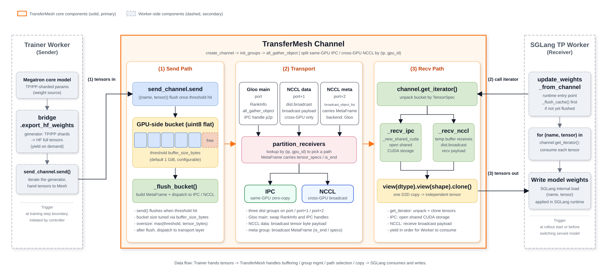

# TransferMesh Weight Transfer

TransferMesh is the weight synchronization component between training and inference processes in LoongSage, implemented under `coda/transfer_mesh/`. At the end of each training step, the training side needs to synchronize the latest parameters to the SGLang inference engine for the next round of rollout. The goals of TransferMesh are:

- Automatically detect the physical topology between senders (trainer workers) and receivers (TP workers inside a rollout engine); same-GPU pairs use CUDA IPC zero-copy, cross-GPU pairs use NCCL broadcast;
- Aggregate thousands of small tensors into a few communication rounds through a GPU-side bucket. The flush threshold is controlled by `buffer_size_bytes` (default 1 GiB, configurable);
- Decouple from the existing NCCL / Gloo groups of `torch.distributed`; do not depend on the default process group, so it can be initialized and destroyed independently inside a Ray actor;
- Interoperate with SGLang's `update_weights_from_channel` HTTP interface for online hot-swap of weights.

TransferMesh is not responsible for aggregating Megatron's TP/PP shards (that part is handled by `megatron.bridge.export_hf_weights`), nor is it responsible for how SGLang internally writes the received tensors into its model weights (that part is implemented by the SGLang engine). TransferMesh only guarantees that "for any tensor provided by the sender, the receiver obtains a complete tensor with an identical shape and name."

## 1. Key Parameters

A TransferMesh channel is created via [`ChannelMeta`](../../coda/utils/channel_helper.py), which is constructed at runtime by [`Trainer._init_channel_meta`](../../coda/controller/trainer.py). `ChannelMeta` explicitly distinguishes **required fields** (no defaults) from **optional fields** (all with defaults); business code only needs to supply the required ones to bring up a channel.

### 1.1. Required Fields

The following three fields have no defaults and must be supplied when constructing `ChannelMeta`. They determine the rendezvous point, the total number of participants, and the sender/receiver rank offset.

| Field | Value | Description |
| --- | --- | --- |
| `master_addr` | Provided by `scheduler.get_gloo_master_address()` | IP used by rank 0 for Gloo TCPStore rendezvous. |
| `world_size` | `train_world_size + rollout_world_size` | Total ranks in this channel; equals the sum of training GPUs and rollout GPUs. |
| `train_world_size` | Number of trainer GPUs | Training-side world size; this value is added to the receiver's rank so that receiver ranks do not collide with sender ranks (see `_compute_rank`). |

### 1.2. Optional Fields (with defaults)

All of the following fields have defaults in `ChannelMeta` and only need to be overridden when deviating from the default behavior.

| Field | Default | Description |
| --- | ---: | --- |
| `engine_id` | `0` | Distinguishes different SGLang engines in multi-replica scenarios and participates in rank computation: `engine_id * dist.get_world_size() + dist.get_rank()` (`dist.get_world_size()` here is the training / inference process's own dist world size, not the channel-level `world_size` in this table; receivers additionally add `+ train_world_size`). |
| `recreate` | `False` | Whether to force-close and recreate the process-local channel. Set to `True` when the rollout side detects a new engine (`num_new_engines > 0`); when `rollout.use_fault_tolerance` is enabled, `_init_channel_meta` first invokes `recover_faulty_engines()`, and fault recovery reaches the same branch by bumping `num_new_engines`. |
| `buffer_size_bytes` | `1 GiB` | Sender-side bucket flush threshold. The default is defined at [`channel.py:104`](../../coda/transfer_mesh/channel.py). A flush is triggered once accumulated bytes ≥ the threshold; for tensors exceeding the threshold, the bucket is sized as `max(threshold, tensor_bytes)`, so the actual bucket size is not fixed at 1 GiB. |
| `timeout` | `300s` | Timeout for Gloo/NCCL collective operations. |
| `gloo_port` | `29500` | Gloo TCPStore port. TransferMesh additionally uses `port+1` (NCCL data group, NCCL backend) and `port+2` (NCCL metadata group, Gloo backend, transporting control frames via `broadcast_object_list`) internally. |
| `local_ip` | `None` | Local IP; when unspecified, resolved in order: `HOST_IP` env var → Ray; raises `RuntimeError` if all methods fail. |

`gpu_id`, `rank`, and `addr` are auto-resolved inside the process by [`channel_helper.py`](../../coda/utils/channel_helper.py) and do not need to be filled in by business code. Senders and receivers only need to provide `Role.SENDER` / `Role.RECEIVER`.

## 2. Principles

The following diagram highlights TransferMesh as the core channel: the solid orange box in the middle is TransferMesh itself, organized in three stages — **(1) Send Path** (`send_channel.send` + GPU bucket buffer + `_flush_bucket`), **(2) Transport** (Gloo main group / NCCL data group / NCCL metadata group + `partition_receivers` topology partitioning), and **(3) Recv Path** (`get_iterator` bucket unpacking + `payload.view.clone()` independent copy). The dashed gray boxes on either side are the Worker-side call sites — the sender (trainer worker) hands tensors to TransferMesh one by one via `bridge.export_hf_weights`, and the receiver (SGLang TP worker) consumes the weight stream via `update_weights_from_channel` and writes it into the model. The two badges below `partition_receivers` correspond to the same-GPU IPC zero-copy path and the cross-GPU NCCL broadcast path respectively.



### 2.1. Components

TransferMesh consists of three modules:

| File | Core Objects | Purpose |
| --- | --- | --- |
| [`topology.py`](../../coda/transfer_mesh/topology.py) | `Role`, `RankInfo`, `partition_receivers` | Topology discovery and IPC/NCCL partitioning |
| [`protocol.py`](../../coda/transfer_mesh/protocol.py) | `TensorSpec`, `MetaFrame`, `str_to_dtype` | Bucket-level metadata protocol |
| [`channel.py`](../../coda/transfer_mesh/channel.py) | `TransferMeshChannel`, `create_channel` | Channel lifecycle, bucket aggregation, send/receive paths |

`TransferMeshChannel` is constructed by `create_channel()`, which invokes `init_groups()` immediately after construction, performing the Gloo group setup, topology gathering, and NCCL group setup in a single call. [`channel_helper.py`](../../coda/utils/channel_helper.py) additionally maintains a module-level `_channel` singleton per process, reused by `create_sender_channel(meta)` / `create_receiver_channel(meta)`.

### 2.2. Communication Topology

`init_groups` uses the private APIs of `torch.distributed.distributed_c10d` (abstracted by [`_c10d_compat.py`](../../coda/transfer_mesh/_c10d_compat.py)) to **create process groups independently**, without depending on the default process group. This means that even if Megatron or SGLang has already initialized the default group with NCCL, TransferMesh can still coexist with its own Gloo/NCCL groups in the same process.

Topology discovery only takes a single `all_gather_object` round: every rank broadcasts a `RankInfo(rank, gpu_id, ip, role)`, after which every rank can see the full deployment view. `partition_receivers` looks up each receiver by `(ip, gpu_id)`:

- Matches a co-located sender → joins that sender's `ipc_assignments` (same-GPU IPC);
- No match → falls into `nccl_receivers` (broadcast from `src_rank` via NCCL).

If two senders share the same `(ip, gpu_id)`, `partition_receivers` raises `ValueError` (see [`topology.py:66-70`](../../coda/transfer_mesh/topology.py)), surfacing configuration errors as early as possible during topology construction. Furthermore, the `gpu_id` reported by each process is not `torch.cuda.current_device()` directly; it is resolved by `_get_physical_gpu_id()` in [`channel_helper.py`](../../coda/utils/channel_helper.py) by parsing `CUDA_VISIBLE_DEVICES` (indexing into it with `torch.cuda.current_device()`, and falling back to `torch.cuda.current_device()` when the variable is unset, cannot be parsed, or does not cover that index). This resolution is a prerequisite for correct IPC matching, because inside a Ray actor the local device index is always 0 regardless of physical placement.

Two additional groups (each using an independent TCPStore port) are created only when there are cross-GPU receivers:

- `_nccl_data_group` (NCCL backend): carries the tensor payload;
- `_nccl_meta_group` (Gloo backend): broadcasts the `MetaFrame` control frame via `broadcast_object_list`.

Same-GPU IPC requires no extra group; it performs point-to-point handle passing directly on the main Gloo group.

### 2.3. Sender Side: Bucket Aggregation and Streaming Conversion

The training-side sending logic is centralized at [`megatron_train_worker.py:554-560`](../../coda/backends/megatron/megatron_train_worker.py):

```python
send_channel = create_sender_channel(channel_meta)
for name, tensor in self.bridge.export_hf_weights(self.model):
    send_channel.send((name, tensor))
send_channel.send(None, flush=True)
```

- `bridge.export_hf_weights` is a **generator** returned by `megatron.bridge.AutoBridge`. Before sending, it reconstructs Megatron's TP/PP shards into standard HuggingFace complete format via operations like all-gather, yielding tensor by tensor and releasing each after use. Sending and aggregation logic is therefore transparent to the training-side parallel strategy.
- `send()` internally maintains a bucket `self._buffer` (a 1-D flat uint8 buffer storing raw bytes; per-tensor dtype is carried separately in each `TensorSpec.dtype`), with the following behavior:
  - If the remaining bytes cannot hold the next tensor, flush first, then re-allocate a bucket of size `max(buffer_size_bytes, tensor_bytes)`;
  - Each tensor is D2D-copied into the bucket once via `flat_tensor = tensor.flatten().contiguous().view(torch.uint8)`, and a `TensorSpec(name, shape, offset, dtype)` is appended (`offset` is in bytes); for non-contiguous tensors, `flatten()` first allocates a contiguous copy, incurring one extra D2D copy;
  - When the accumulated bytes ≥ `buffer_size_bytes` (default 1 GiB), `_flush_bucket()` is called to send the whole bucket;
  - Calling `send(None)` or `send(..., flush=True)` immediately triggers `_flush_bucket(is_end=True)`, which broadcasts the "end-of-stream" marker to receivers and constitutes the normal termination path for the send stream.

**The bucket is allocated independently per sender process** (rather than globally shared), and after sending, `self._buffer = None`; the next `send()` will re-allocate a fresh GPU buffer sized as `max(buffer_size_bytes, tensor_bytes)`, working together with `torch.cuda.ipc_collect()` to reclaim shared memory.

The scheduling order of `_flush_bucket()` (metadata is broadcast before the payload so that cross-GPU receivers can pre-allocate the receive buffer according to `payload_numel`):

1. Build `MetaFrame(is_end, tensor_specs, payload_numel)` (`payload_numel` is the accumulated bytes in the bucket; since `payload` itself is uint8, the number of elements equals the number of bytes);
2. If there are cross-GPU receivers and the current rank is `src_rank` → broadcast metadata via `_nccl_meta_group.broadcast_object_list`;
3. If there are same-GPU receivers → use the IPC path (next section);
4. If there are cross-GPU receivers and the current rank is `src_rank` → `broadcast(payload)` on `_nccl_data_group`;
5. Clear the bucket and call `ipc_collect()`.

### 2.4. Same-GPU IPC Path (Zero-Copy)

`_send_ipc` sends only the IPC handle and the bucket-level metadata; it does not transfer the tensor body:

```python
ipc_handle = tensor.untyped_storage()._share_cuda_()
handle_data = {"ipc_handle": ipc_handle, "size": ..., "dtype": ..., "shape": ..., "meta": meta}
handle_bytes = pickle.dumps(handle_data)
payload = torch.tensor(list(handle_bytes), dtype=torch.uint8)
header = torch.tensor([len(handle_bytes)], dtype=torch.int64)
for recv_rank in receiver_ranks:
    dist.send(header, dst=recv_rank, group=self._gloo_group)
    dist.send(payload, dst=recv_rank, group=self._gloo_group)
```

- `_share_cuda_()` internally calls the CUDA `cudaIpcGetMemHandle`, registering the sender's GPU memory as cross-process shared, and returns a tuple-form handle; the `handle_data` dict also packs the `MetaFrame` describing the bucket layout (with all `TensorSpec` entries);
- The main Gloo group sends in two steps: first an 8-byte header carrying the payload length, then the serialized handle payload. What flows over the CPU side is the handle plus bucket metadata (negligible compared with the GB-scale bucket tensor body), and no cross-GPU D2D copy is involved.

Receiver side `_recv_ipc`:

```python
storage = UntypedStorage._new_shared_cuda(*ipc_handle)
tensor = torch.empty(size, dtype=dtype, device=self._local_device)
tensor.set_(storage)
```

Before opening the shared memory, if the device field of the handle tuple differs from the receiver's local device index, it is replaced with the receiver's local device index, avoiding the offset caused by single-device visibility of `CUDA_VISIBLE_DEVICES` inside a Ray actor. After binding, what the receiver reads is exactly the sender's bucket in physical GPU memory.

### 2.5. Cross-GPU NCCL Path

`_send_nccl` broadcasts the current bucket via `dist.broadcast` to `_nccl_data_group`; cross-GPU receivers, in `_recv_nccl`, allocate a temporary receive buffer according to the `payload_numel` declared by `MetaFrame`. A bucket is not necessarily filled to capacity (for example, when a single tensor happens to trigger a flush, or when the stream terminates early); therefore the actual payload size per flush varies and is typically smaller than `buffer_size_bytes`.

Metadata is broadcast separately on `_nccl_meta_group` via `broadcast_object_list` (what is actually transmitted are the pickle bytes produced by `MetaFrame.serialize()`, wrapped in a list); this way, even when the payload is 0 (only an `is_end` marker), the receiver still correctly receives the "end of stream" notification.

### 2.6. Receiver Side: Bucket Unpacking and Independent Copy

The receiver-side core logic lives in `get_iterator()`:

```python
for spec in meta.tensor_specs:
    tensor_dtype = str_to_dtype(spec.dtype)
    num_bytes = spec.numel() * tensor_dtype.itemsize
    raw_bytes = payload[spec.offset:spec.offset + num_bytes]
    tensor = raw_bytes.view(tensor_dtype).view(spec.shape).clone()
    yield (spec.name, tensor)
```

`payload` is a uint8 raw-byte buffer; both `spec.offset` and `num_bytes` are in bytes. The slice is first `view`ed back to the original dtype via `spec.dtype`, then `view`ed back to the original shape. The final `.clone()` is the crucial D2D copy that copies the slice from the shared bucket (sender's GPU memory in the IPC case / temporary receive buffer in the NCCL case) into the receiver's own GPU memory as an independent copy. This is done so that downstream code can safely hold the tensor: the sender will release and rebuild the bucket on the next `send()`, and the shared memory itself may be overwritten or reclaimed at any time.

`get_iterator()` also supports `yield_buckets=True`: it hands the whole bucket `(payload, meta)` to the caller at once, letting the caller split it by `TensorSpec`. This is suitable for receivers pursuing finer-grained scheduling (for example, SGLang can dispatch tensors to TP workers concurrently with reception).

### 2.7. Lifecycle

> **Key point: meta is generated by the trainer; neither side of the engines needs to interpret its contents.** The decoupling manifests at two levels:
>
> - **Channel-level `ChannelMeta`**: centrally constructed by [`Trainer._init_channel_meta`](../../coda/controller/trainer.py) and handed to both the sender (trainer worker) and the receiver (SGLang engine) as an opaque object. Both sides simply pass it whole to `create_sender_channel(meta)` / `create_receiver_channel(meta)` without reading or interpreting any of its fields — `world_size`, `buffer_size_bytes`, `gloo_port`, and so on are all consumed internally by TransferMesh.
> - **Bucket-level `MetaFrame` / `TensorSpec`**: filled in automatically by the sender inside `_flush_bucket` and parsed by the receiver's `get_iterator` according to the protocol. The trainer worker and the SGLang engine never construct, read, or modify any field of `MetaFrame`; they only interact via `send((name, tensor))` / `get_iterator()`.
>
> Consequently, **the weight-transfer flow is fully decoupled from the training engine (Megatron etc.) and the inference engine (SGLang etc.)** — swapping either side's implementation only requires plugging into the channel APIs following the `ChannelMeta` contract, and TransferMesh can be reused without the engine side having to understand any meta semantics.

- **Create/reuse**: `create_sender_channel(meta)` / `create_receiver_channel(meta)` are idempotent process-level entry points. When `meta.recreate=True`, the existing channel is closed and a new one is created; when `recreate=False` and a channel already exists, it is reused directly.
- **Send-stream termination**: The sender calls `send(None, flush=True)`, triggering a final flush with `is_end=True`; the receiver iterator terminates its loop when it sees `meta.is_end`.
- **Destruction**: `close()` destroys the NCCL data/metadata groups and the main Gloo group in order, and clears internal state such as `_ipc_assignments`, `_nccl_receivers`, `_buffer`, `_buffer_offset`, and `_pending_specs`; the sender additionally calls `ipc_collect()` once more to reclaim shared memory (receivers are not involved).

## 3. Top-Level Call Chain

A complete weight transfer is orchestrated by [`Trainer._update_weights`](../../coda/controller/trainer.py):

```text
Trainer._update_weights(meta, weight_version)
  ├── TrainManager.async_update_weights(meta)
  │     └── For each train worker (Megatron): update_weights(meta)
  │           ├── create_sender_channel(meta)
  │           ├── for (name, tensor) in bridge.export_hf_weights(self.model):
  │           │       send_channel.send((name, tensor))
  │           ├── send_channel.send(None, flush=True)
  │           └── If `self.offloaded` is True (meaning `offload()` was called earlier), `_offload_model(move_params=True, move_grads=False)` moves the training parameters previously retained on GPU to CPU
  └── RolloutManager.async_update_weights(meta, weight_version)
        └── For each SGLang engine: update_weights_from_channel(meta_dict)
              ├── If not yet flushed (`_cache_flushed=False`): _flush_cache()  # Clear old KV / prefix cache
              └── Invoke SGLang `update_weights_from_channel` HTTP interface  # SGLang internally receives the weight stream via TransferMesh and overwrites the old weights
```

Both sides of `async_update_weights` return lists of Ray `ObjectRef`s, and `_update_weights` uses `ray.get(all_refs)` to wait for both training and inference sides to finish together, ensuring the sender and the receiver are matched within the same channel lifecycle.

`_init_channel_meta` recomputes `world_size` every time and decides whether to set `recreate`: whenever a new engine is added on the rollout side (e.g., fault tolerance has recovered a faulty engine), it re-fetches the Gloo master address and port from the scheduler and forces both sides to recreate the channel.

## 4. Relationship with colocate / fully-async Mode

TransferMesh itself does not distinguish modes, but the scheduling context differs between the two modes, as reflected in [`Trainer.train_loop`](../../coda/controller/trainer.py):

- **colocate mode** (rollout and trainer share the same GPU pool): because a single GPU cannot hold two full sets of model state simultaneously, "staggered scheduling" on the GPU is required before and after `update_weights`:
  1. `train_manager.offload()`: offloads the training-side gradients and optimizer state to CPU, **but keeps parameters on GPU** (in [`megatron_train_worker.py:586`](../../coda/backends/megatron/megatron_train_worker.py), `move_params=False`, with the comment "keep params in gpu for latter update weights");
  2. `rollout_manager.onload_weights()`: reloads SGLang's weight container onto GPU (`tags=[GPU_MEMORY_TYPE_WEIGHTS]`), while the KV cache remains on CPU;
  3. `_update_weights(...)`: performs the weight transfer through TransferMesh. At this point, same-GPU senders (trainer workers) and receivers (SGLang TP workers) automatically select the IPC zero-copy path;
  4. Once the transfer completes, if `offload()` was called earlier (`self.offloaded=True`), `update_weights` internally invokes `_offload_model(move_params=True, move_grads=False)` to fully offload the training parameters to CPU;
  5. `rollout_manager.onload_kv()`: reloads the KV cache onto GPU, entering the next step's rollout.

- **fully-async mode** (rollout and trainer are resident on separate GPUs): does not involve `offload_train` / `onload_rollout_weights` / `onload_rollout_kv` stages; both models stay resident on their own GPUs. After `pause()` at the step boundary completes, `_init_channel_meta()` + `_update_weights()` are invoked directly. At this point, there are typically no sender/receiver pairs co-located on the exact same physical GPU (i.e., matching `(ip, gpu_id)`), so TransferMesh automatically falls back to the cross-GPU NCCL broadcast path.

Regardless of mode, `SglangEngine.update_weights_from_channel` always calls `_flush_cache()` before actually loading the new weights, clearing the prefix / KV cache corresponding to the old weights to prevent mixing old and new state. In colocate mode, `release_memory_occupation` has already flushed once, and the `_cache_flushed` marker is used to skip one redundant flush.

## 5. Quick Start

### 5.1. Basic Usage

**Sender**

```python
import torch
from coda.transfer_mesh import create_channel, Role

channel = create_channel(
    master_addr="127.0.0.1",    # Rank 0's address for coordination
    addr="127.0.0.1",           # Local IP address
    gpu_id=0,                   # Local GPU device ID
    world_size=2,               # Total participant count
    rank=0,                     # This node's rank
    role=Role.SENDER,           # Role.SENDER or Role.RECEIVER
    src_rank=0,                 # Primary sender rank
    buffer_size_bytes=1024 * 1024 * 1024,  # Bucket size (default 1 GiB)
)

# Send tensors (accumulated in buffer, auto-flushed when full)
for name, tensor in model_weights:
    channel.send((name, tensor))

# flush=True: flush remaining buffered tensors and broadcast end-of-stream marker
channel.send(None, flush=True)
channel.close()
```

**Receiver**

```python
channel = create_channel(
    master_addr="127.0.0.1",
    addr="127.0.0.1",
    gpu_id=0,
    world_size=2,
    rank=1,
    role=Role.RECEIVER,
    src_rank=0,
)

# Receive tensors as iterator
for name, tensor in channel.get_iterator():
    model.load_single_weight(name, tensor)
channel.close()
```

### 5.2. Multi-GPU Colocated Scenario

When senders and receivers are colocated on the same GPUs, TransferMesh automatically uses IPC for zero-copy transfer:

```
Topology (world_size=8):
  GPU 0: Rank 0 (sender)  ──IPC──>  Rank 4 (receiver)
  GPU 1: Rank 1 (sender)  ──IPC──>  Rank 5 (receiver)
  GPU 2: Rank 2 (sender)  ──IPC──>  Rank 6 (receiver)
  GPU 3: Rank 3 (sender)  ──IPC──>  Rank 7 (receiver)
```

```python
# Each sender process (rank 0-3)
channel = create_channel(
    master_addr="10.0.0.1",
    addr="10.0.0.1",
    gpu_id=rank,           # Same as corresponding receiver's gpu_id
    world_size=8,
    rank=rank,
    role=Role.SENDER,
    src_rank=0,
)

# Each receiver process (rank 4-7)
channel = create_channel(
    master_addr="10.0.0.1",
    addr="10.0.0.1",
    gpu_id=rank - 4,       # Matches corresponding sender
    world_size=8,
    rank=rank,
    role=Role.RECEIVER,
    src_rank=0,
)
```

## 6. Usage Constraints

- **`src_rank` is currently fixed at 0**. All cross-GPU NCCL broadcasts originate from rank 0; if rank 0 becomes a bottleneck, consider replacing it or further sharding.
- **Same-GPU IPC requires the sender and receiver to be on the exact same physical GPU** (`(ip, gpu_id)` must match exactly). Split deployment or replica topology changes will automatically use the NCCL path with no business awareness needed, but the two sides' `world_size` and `train_world_size` computations must stay consistent.
- **`world_size` depends on precise total GPU count computation**: `train_world_size = trainer.num_gpus_per_node * trainer.num_nodes`, and `rollout_world_size` is summed across replicas as `num_nodes * rollout.num_gpus_per_node`; any misconfiguration on either side will cause a deadlock at the all_gather stage.
- **Depends on `torch.distributed.distributed_c10d` private APIs**: symbols such as `_new_process_group_helper` and `_world.pg_group_ranks` are not covered by PyTorch's stable API guarantees; [`_c10d_compat.py`](../../coda/transfer_mesh/_c10d_compat.py) centralizes symbol loading and produces clear error messages stamped with `torch.__version__`. When upgrading PyTorch major versions, prioritize checking this layer for compatibility.
- **The 1 GiB bucket size is an empirical value**: too small a value increases communication rounds; too large a value drives up peak memory and flush jitter. It can be tuned via `ChannelMeta.buffer_size_bytes`, but ensure that the receiver has enough memory to accommodate it (on the NCCL path, the receiver also needs to temporarily allocate a receive buffer of the corresponding size).

## 7. Source Entry Points

- [`TransferMeshChannel`](../../coda/transfer_mesh/channel.py) — Core channel implementation
- [`partition_receivers`](../../coda/transfer_mesh/topology.py) — Topology partitioning
- [`MetaFrame` / `TensorSpec`](../../coda/transfer_mesh/protocol.py) — Bucket metadata protocol
- [`ChannelMeta` / `create_sender_channel` / `create_receiver_channel`](../../coda/utils/channel_helper.py) — In-process channel lifecycle
- [`Trainer._init_channel_meta` / `Trainer._update_weights`](../../coda/controller/trainer.py) — Top-level orchestration
- [`MegatronTrainWorker.update_weights`](../../coda/backends/megatron/megatron_train_worker.py) — Training-side send
- [`SglangEngine.update_weights_from_channel`](../../coda/backends/sglang/engine.py) — Inference-side receive
